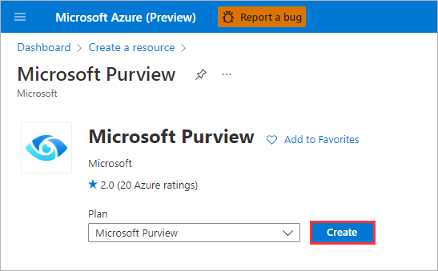
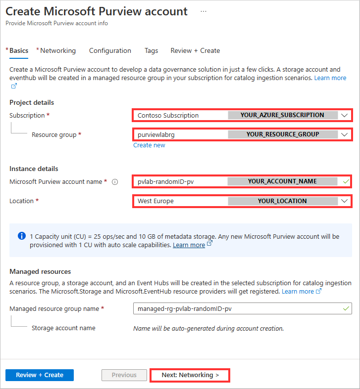
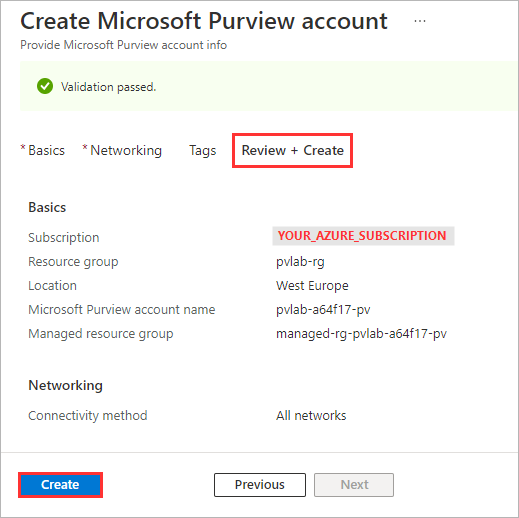
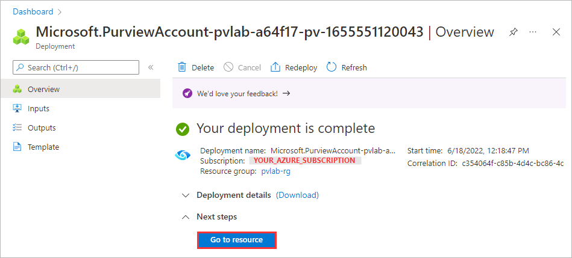
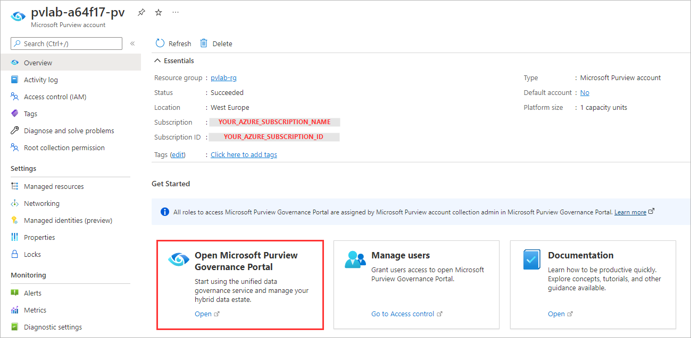

# Module 01 - Create an Azure Purview Account

**[Home](../README.md)** - [Next Module>](../modules/module02.md)

## :thinking: Prerequisites

* An [Azure account](https://azure.microsoft.com/en-us/free/) with an active subscription.
* Your must have permissions to create resources in your Azure subscription.
* Your subscription must have the following resource providers registered: **Microsoft.Purview**, **Microsoft.Storage**, and **Microsoft.EventHub**.

## :loudspeaker: Introduction

To create and use the Azure Purview platform, you will need to provision an Azure Purview account.

## :dart: Objectives

Create an Azure Purview account using the Azure portal.

## Table of Contents

1. [Create an Azure Purview Account](#1-create-an-azure-purview-account)
2. [Grant Access to Azure Purview's Data Plane](#2-grant-access-to-azure-purviews-data-plane)
3. [Open Purview Studio](#3-open-purview-studio)

<a href="#module-01---create-an-azure-purview-account">↥ back to top</a>

## 1. Create an Azure Purview Account

1. Sign in to the [Azure portal](https://portal.azure.com) with your Azure account and from the **Home** screen, click **Create a resource**.

      

2. Search the Marketplace for "Azure Purview" and click **Create**.

    

3. Provide the necessary inputs on the **Basics** tab.  
    Note: The table below provides example values for illustrative purposes only, ensure to specify values that make sense for your deployment.

    | Parameter  | Example Value |
    | --- | --- |
    | Subscription | `Azure Internal Access` |
    | Resource group | `purviewlab` |
    | Purview account name | `purview-69426` |
    | Location | `Brazil South` |

    

4. Provide the necessary inputs on the **Configuration** tab.

    | Parameter  | Example Value | Note |
    | --- | --- | --- |
    | Platform size | `4 capacity units` | Sufficient for non-production scenarios. |

    > :bulb: **Did you know?**
    >
    > **Capacity Units** determine the size of the platform and is a **provisioned** (fixed) set of resources that is needed to keep the Azure Purview platform up and running. 1 Capacity Unit is able to support approximately 1 API call per second. Capacity Units are required regardless of whether you plan to invoke the Azure Purview API endpoints directly (i.e. ISV scenario) or indirectly via Purview Studio (GUI).
    > 
    > **v-Core Hours** on the other hand is the unit used to measure **serverless** compute that is needed to run a scan. You only pay per vCore-Hour of scanning that you consume (rounded up to the nearest minute).
    >
    > For more information, check out the [Azure Purview Pricing](https://azure.microsoft.com/en-us/pricing/details/azure-purview/) page.

    

5. On the **Review + Create** tab, once the message in the ribbon returns "Validation passed", verify your selections and click **Create**.

    

6. Wait several minutes while your deployment is in progress. Once complete, click **Go to resource**.

    

<a href="#module-01---create-an-azure-purview-account">↥ back to top</a>

## 2. Grant Access to Azure Purview's Data Plane

1. Navigate to your Azure Purview account and select **Access Control (IAM)** from the left navigation menu.

    

2. Click **Add role assignments**.

    

3. Populate the role assignment prompt as per the table below, select the targeted Azure AD identities, click **Save**.

    | Property  | Value |
    | --- | --- |
    | Role | `Purview Data Curator` |
    | Assign access to | `User, group, or service principal` |
    | Select | `<Azure AD Identities>` |

    

    > :bulb: **Did you know?**
    >
    > Azure Purview defines a set of pre-defined Data Plane roles that can be used to control who can access what.
    >

    | Role  | Catalog | Sources/Scans | Description | 
    | --- | --- | --- | --- |
    | Purview Data Reader | `Read` |  | Access to Purview Studio (read only). |
    | Purview Data Curator | `Read/Write` |  | Access to Purview Studio (read & write). |
    | Purview Data Source Administrator |  | `Read/Write` | No access to Purview Studio. Manage data sources and data scans. |

4. Navigate to the **Role assignments** tab and confirm the **Purview Data Curator** role been has been assigned. Tip: Filter **Scope** to `This resource`.

    

5. Repeat the previous steps by adding a second role to the same set of Azure AD identities, this time with the **Purview Data Source Administrator** role.

    

<a href="#module-01---create-an-azure-purview-account">↥ back to top</a>

## 3. Open Purview Studio

1. To open the out of the box user experience, navigate to the Azure Purview account instance and click **Open Purview Studio**.

    

<a href="#module-01---create-an-azure-purview-account">↥ back to top</a>

## :mortar_board: Knowledge Check

1. Which of the following Azure Purview pricing meters is fluid, with consumption varying based on usage?

    A ) Capacity Units  
    B ) vCore Hours  
    C ) Neither

2. Which of the following Azure Purview pricing meters is fixed, with consumption based on quantity provisioned?

    A ) Capacity Units  
    B ) vCore Hours  
    C ) Neither

3. Which Azure Purview module provides the base funcionality (i.e. source registration, automated scanning and classification, data discovery)?

    A ) C0  
    B ) C1  
    C ) D0

4. Which pre-defined Azure Purview role provides access to manage data sources?

    A ) Purview Data Reader  
    B ) Purview Data Curator  
    C ) Purview Data Source Administrator

<a href="#module-01---create-an-azure-purview-account">↥ back to top</a>

## :tada: Summary

This module provided an overview of how to create an Azure Purview account instance.
