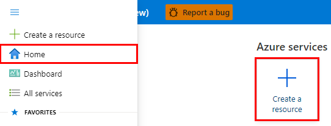
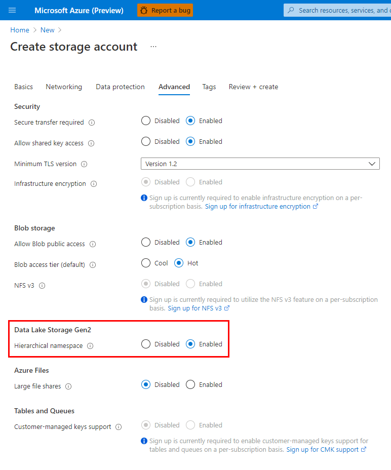

# Module 02 - Register & Scan

[< Previous Module](../modules/module01.md) - **[Home](../README.md)** - [Next Module>](../modules/module03.md)

## Prerequisites

* An Azure account with an active subscription.
* An Azure Azure Purview account (see [previous module](../modules/module01.md)).
* An Azure Data Lake Storage Gen2 account (instructions below).

## Tools

* [Azure Storage Explorer](https://azure.microsoft.com/en-us/features/storage-explorer/)

## Introduction

To populate Azure Purview with assets for data discovery and understanding, we must register sources that exist across our data estate so that we can leverage the out of the box scanning capabilities. Scanning enables Azure Purview to extract technical metadata such as fully qualified name, schema, data types, and apply classifications on assets by parsing a sample of the underlying data. In this module, we will walk through how to register and scan an Azure Data Lake Storage Gen2 account.

## Learning Objectives

* Create a Collection.
* Register a source.
* Scan a source.

## Sign in to Azure

Sign in to the [Azure portal](https://portal.azure.com) with your Azure account.

## Create an Azure Data Lake Storage Gen2 Account

1. From the **Home** screen, click **Create a resource**.

      

2. Under "Popular", click **Storage account**.

    

3. Provide the necessary inputs on the **Basics** tab.
    | Parameter  | Example Value |
    | --- | --- |
    | Subscription | `Azure Internal Access` |
    | Resource group | `purviewlab` |
    | Purview account name | `storage69426` |
    | Location | `(South America) Brazil South` |
    | Performance | `Standard` |
    | Account kind | `StorageV2 (general purpose v2)` |
    | Replication | `Locally-redundant storage (LRS)` |

    Note:

    * The storage account name can only contain lowercase letters and numbers.
    * The storage account name must be between 3 and 24 characters.

    

4. On the **Advanced** tab, set the **Hierarchal namespace** to **Enabled**.

    

5. On the **Review + Create** tab, once the message in the ribbon returns "Validation passed", verify your selections and click **Create**.

    

6. Wait several minutes while your deployment is in progress. Once complete, click **Go to resource**.

    