# Module 02B - Register & Scan (Azure SQL DB)

[< Previous Module](../modules/module02a.md) - **[Home](../README.md)** - [Next Module >](../modules/module03.md)

## :thinking: Prerequisites

* An [Azure account](https://azure.microsoft.com/en-us/free/) with an active subscription.
* An Azure SQL Database (see [module 00](../modules/module00.md)).
* An Azure Azure Purview account (see [module 01](../modules/module01.md)).

## :loudspeaker: Introduction

To populate Azure Purview with assets for data discovery and understanding, we must register sources that exist across our data estate so that we can leverage the out of the box scanning capabilities. Scanning enables Azure Purview to extract technical metadata such as the fully qualified name, schema, data types, and apply classifications by parsing a sample of the underlying data. In this module, we will walk through how to register and scan data sources.

## :dart: Objectives

* Register and scan an Azure SQL Database using SQL authentication credentials stored in Azure Key Vault.

##  :bookmark_tabs: Table of Contents

| #  | Section | Role |
| --- | --- | --- |
| 1 | [Key Vault Access Policy #1 (Grant Yourself Access)](#1-key-vault-access-policy-1-grant-yourself-access) | Azure Administrator |
| 2 | [Key Vault Access Policy #2 (Grant Azure Purview Access)](#2-key-vault-access-policy-2-grant-azure-purview-access) | Azure Administrator |
| 3 | [Generate a Secret](#3-generate-a-secret) | Azure Administrator |
| 4 | [Add Credentials to Azure Purview](#4-add-credentials-to-azure-purview) | Azure Purview Administrator |
| 5 | [Register a Source (Azure SQL DB)](#5-register-a-source-azure-sql-db) | Data Source Administrator |
| 6 | [Scan a Source with Azure Key Vault Credentials](#6-scan-a-source-with-azure-key-vault-credentials) | Data Source Administrator |
| 7 | [View Assets](#7-view-assets) | Data Reader |

<div align="right"><a href="#module-02b---register--scan-azure-sql-db">↥ back to top</a></div>

## 1. Key Vault Access Policy #1 (Grant Yourself Access)
    
> :bulb: **Did you know?**
>
> **Azure Key Vault** is a cloud service that provides a secure store for secrets. Azure Key Vault can be used to securely store keys, passwords, certificates, and other secrets. For more information, check out [About Azure Key Vault](https://docs.microsoft.com/en-us/azure/key-vault/general/overview).

Before we can add secrets (such as passwords) to Azure Key Vault, we need to set up an [Access Policy](https://docs.microsoft.com/en-us/azure/key-vault/general/assign-access-policy?tabs=azure-portal). The access policy being created in this particular step, ensures that our account has sufficient permissions to create a secret, which will later be used by Azure Purview to perform a scan.

1. Navigate to your **Azure Key Vault** resource and click **Access policies**.
    
    

2. Click **Add Access Policy**.

    

3. Under **Select principal**, click **None selected**.

    

4. Search for your account name, select the item, then click **Select**.

    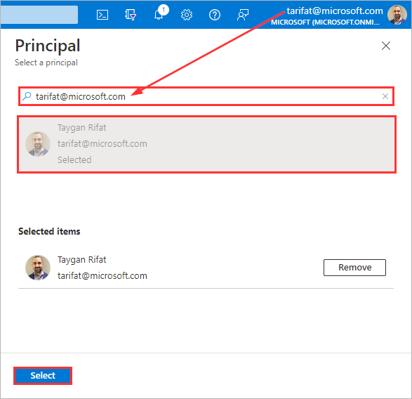

5. Under **Secret permissions**, click **Select all**.

    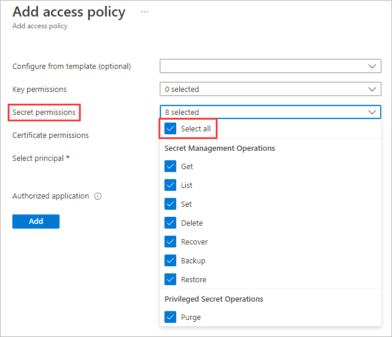

6. Review your selections then click **Add**.

    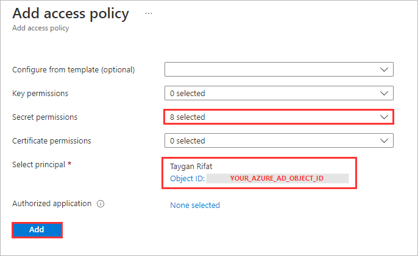

7. Click **Save**.

    

<div align="right"><a href="#module-02b---register--scan-azure-sql-db">↥ back to top</a></div>

## 2. Key Vault Access Policy #2 (Grant Azure Purview Access)

In this next step, we are creating a second access policy which will provide Azure Purview the necessary access to retrieve secrets from the Key Vault.

1. Navigate to your **Azure Key Vault** resource and click **Access policies**.
    
    

2. Click **Add Access Policy**.

    

3. Under **Select principal**, click **None selected**.

    

4. Search for the name of your Azure Purview account (e.g. `pvlab-{randomId}-pv`), select the item, then click **Select**.

    

5. Under **Secret permissions**, select **Get** and **List**.

    

6. Review your selections then click **Add**.

    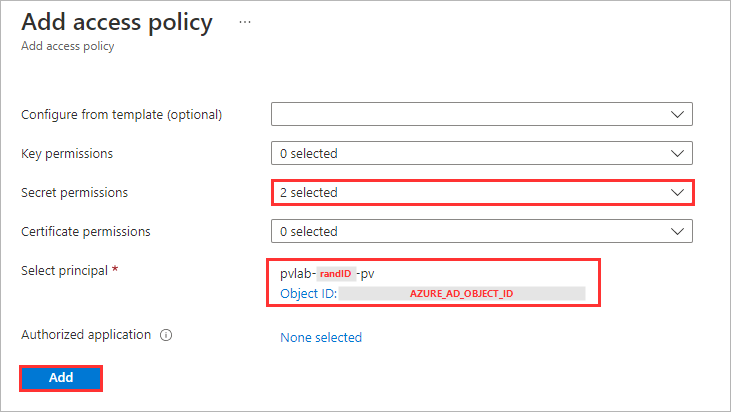

7. Click **Save**.

    

<div align="right"><a href="#module-02b---register--scan-azure-sql-db">↥ back to top</a></div>

## 3. Generate a Secret

1. Navigate to **Secrets** and click **Generate/Import**.

    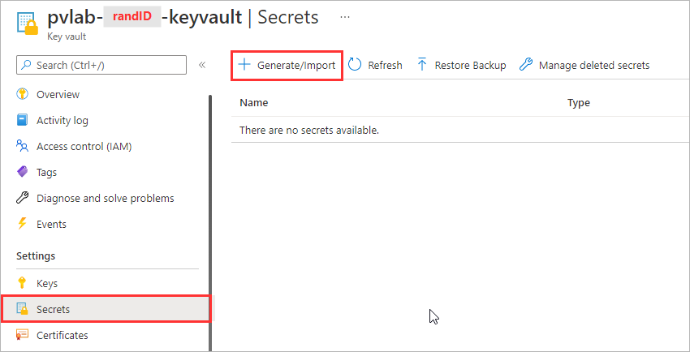

2. **Copy** and **paste** the values below into the matching fields and then click **Create**.

    **Name**
    ```
    sql-secret
    ```
    **Value**
    ```
    sqlPassword!
    ```

    

<div align="right"><a href="#module-02b---register--scan-azure-sql-db">↥ back to top</a></div>

## 4. Add Credentials to Azure Purview

1. To make the secret accessible to Azure Purview, we must first establish a connection to Azure Key Vault. Open **Purview Studio**, navigate to **Management Center** > **Credentials**, click **Manage Key Vault connections**.

    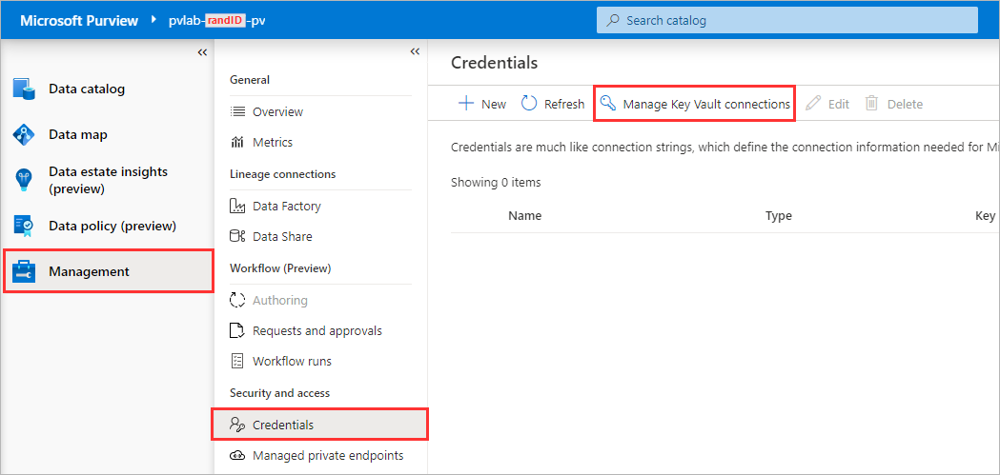

2. Click **New**.

    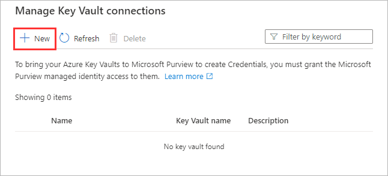

3. **Copy** and **paste** the value below to set the name of your **Key Vault connection**, and then use the drop-down menus to select the appropriate **Subscription** and **Key Vault name**, then click **Create**.

    **Name**
    ```
    myKeyVault
    ```

    

4. Since we have already granted the Purview managed identity access to our Azure Key Vault, click **Confirm**.

    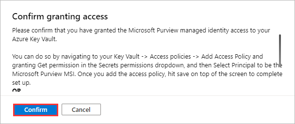

5. Click **Close**.

    

6. Under **Credentials** click **New**.

    

7.  Using the drop-down menu items, set the **Authentication method** to `SQL authentication` and the **Key Vault connection** to `myKeyVault`. Once the drop-down menu items are set, **Copy** and **paste** the values below into the matching fields, and then click **Create**.

    **Name**
    ```
    credential-SQL
    ```

    **User name**
    ```
    sqladmin
    ```

    **Secret name**
    ```
    sql-secret
    ```

    

<div align="right"><a href="#module-02b---register--scan-azure-sql-db">↥ back to top</a></div>

## 5. Register a Source (Azure SQL DB)

1. Open Purview Studio, navigate to **Data map** > **Sources**, and click **Register**.

    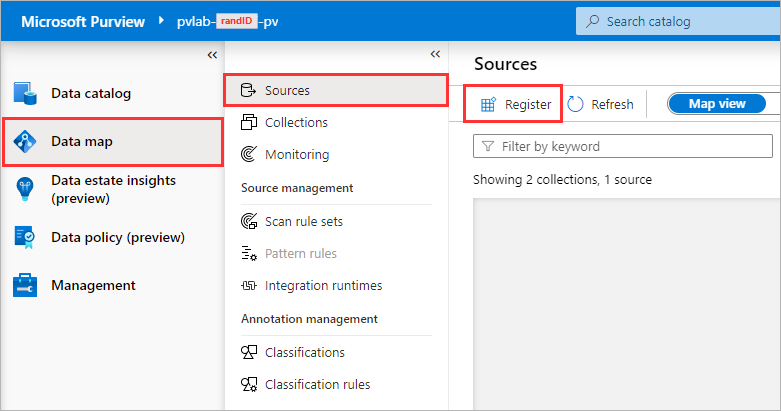

2. Navigate to the **Azure** tab, select **Azure SQL Database**, click **Continue**.

    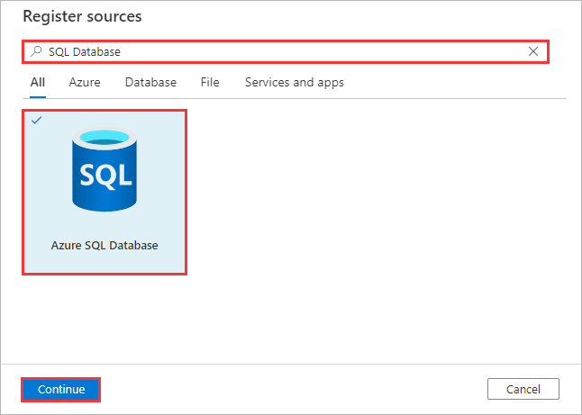

3. Select the **Azure subscritpion**, **Server name**, and **Collection**. Click **Register**.

    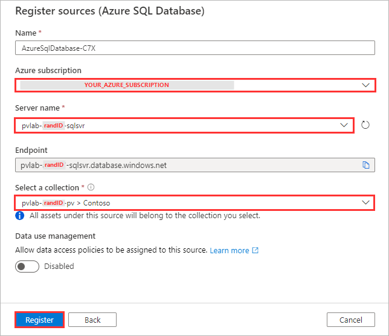

<div align="right"><a href="#module-02b---register--scan-azure-sql-db">↥ back to top</a></div>

## 6. Scan a Source with Azure Key Vault Credentials

1. Open Purview Studio, navigate to **Data map** > **Sources**, and within the Azure SQL Database tile, click the **New Scan** button.

    

2. Select the **Database** and **Credential** from the drop-down menus. Click **Test connection**. Click **Continue**.

    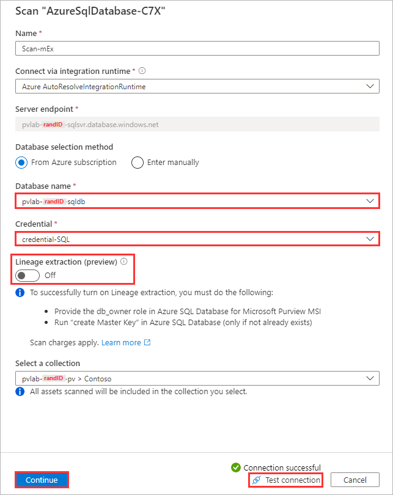

3. Click **Continue**.

    

4. Click **Continue**.

    

5. Set the trigger to **Once**, click **Continue**.

    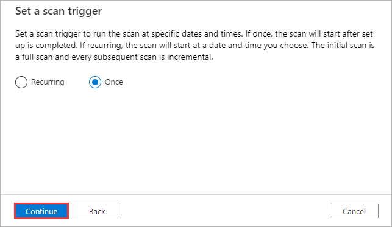

6. Click **Save and Run**.

    

7. To monitor the progress of the scan, click **View Details**.

    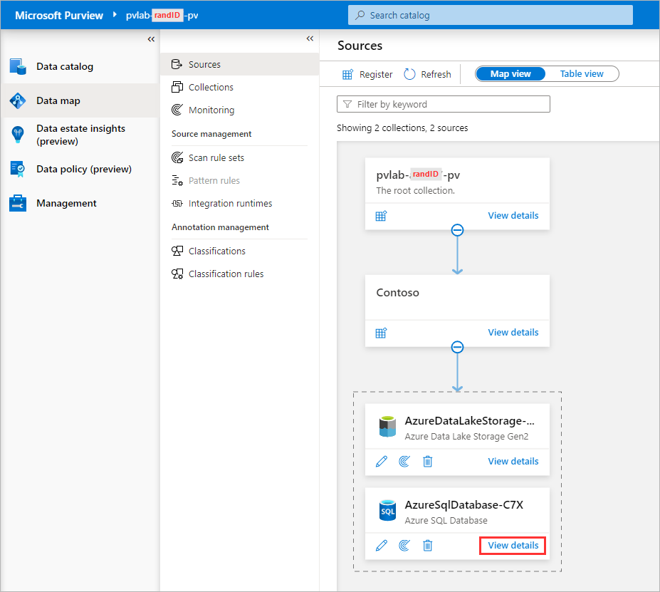

8. Click **Refresh** to periodically update the status of the scan. Note: It will take approximately 5 to 10 minutes to complete.

    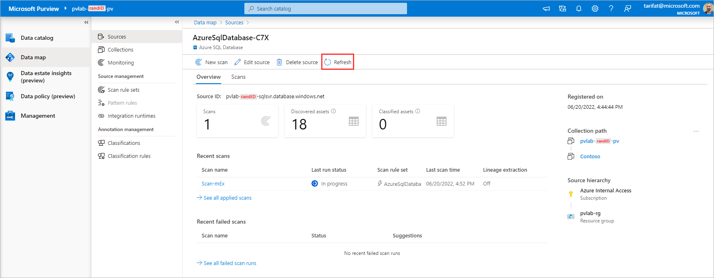

<div align="right"><a href="#module-02b---register--scan-azure-sql-db">↥ back to top</a></div>

## 7. View Assets

1. To view the assets that have materialised as an outcome of running the scans, perform a wildcard search by typing the asterisk character (`*`) into the search bar and hitting the Enter key to submit the query and return the search results.

    

<div align="right"><a href="#module-02b---register--scan-azure-sql-db">↥ back to top</a></div>

## :mortar_board: Knowledge Check

[http://aka.ms/purviewlab/q02](http://aka.ms/purviewlab/q02)

1. What type of object can help organize data sources into logical groups?

    A ) Buckets    
    B ) Collections  
    C ) Groups  

2. At which point does Azure Purview begin to populate the data map with assets?

    A ) After an Azure Purview account is created  
    B ) After a Data Source has been registered    
    C ) After a Data Source has been scanned

3. Which of the following attributes is **not** automatically assigned to an asset as a result of the system-built scanning functionality?

    A ) Technical Metadata (e.g. Fully Qualified Name, Path, Schema, etc)  
    B ) Glossary Terms (e.g. column `Sales Tax` is tagged with the `Sales Tax` glossary term)  
    C ) Classifications (e.g. column `ccnum` is tagged with the `Credit Card Number` classification)  

<div align="right"><a href="#module-02b---register--scan-azure-sql-db">↥ back to top</a></div>

## :tada: Summary

This module provided an overview of how to create a collection, register a source, and trigger a scan.

[Continue >](../modules/module03.md)
