# Module 04 - Glossary

[< Previous Module](../modules/module03.md) - **[Home](../README.md)** - [Next Module >](../modules/module05.md)

## :loudspeaker: Introduction

A [Glossary](https://docs.microsoft.com/azure/purview/concept-business-glossary), sometimes called Data Glossary or Business Glossary, is a list of business terms with their definitions. A Glossary is an important tool for maintaining and organizing information about your data. It is used for capturing domain knowledge of information that is commonly used, communicated, and shared in organizations as they are conducting business.

There aren’t any rules for the size and representation of glossaries. They can stay abstract or high-level, but also are allowed to be detailed, describing carefully attributes, dependencies, relationships and definitions. A glossary isn't limited to only a single database, in fact it can cover many applications or multiple databases. Multiple applications can work together to accomplish a specific business need. This means that the relation between a glossary and data attributes is a one-to-many relationship. The glossary can also include and capture more concepts than the concepts representing the application or database itself. It can include concepts, which are used to make the context clearer, but don’t play a direct role (yet) in the application or database design. It can also include concepts, that represents future requirements, but didn’t find their way yet into the actual design of the application or database yet.

When implementing your Glossary it is important to think about how you will structure your business terms and definitions. For example, you could use hierarchies and align these with business domains such as: Finance, Marketing, Sales, HR, etc. You could think of naming standards or introduce term templates for capturing additional information about your business metadata. You could also use relationships for linking business terms, such as Acronyms, Related terms and Synonyms. These relationships could help to avoid creating terms with duplicated names and lower the overhead of management.

In this lab you learn how to create terms using a system and custom term template. You'll also learn how to import and export terms. Lastly, you learn about linking terms to data assets, which helps to relate technical metadata to business metadata.

## :thinking: Prerequisites

* An [Azure account](https://azure.microsoft.com/free/) with an active subscription.
* A Microsoft Purview account (see [module 01](../modules/module01.md)).

## :dart: Objectives

* Create a Term in the Glossary using the System Default Term Template.
* Create a Term in the Glossary using a Custom Term Template.
* Bulk Import Terms into the Glossary via a CSV file.
* Bulk Export Terms from the Glossary into a CSV file.
* Assign a Term to an Asset in the Data Catalog.
* Update an existing Term with Related Terms and Contacts.

## :bookmark_tabs: Table of Contents

| #  | Section | Role |
| --- | --- | --- |
| 1 | [Create a Term (System Default Term Template)](#1-create-a-term-system-default-term-template) | Data Curator |
| 2 | [Create a Term (Custom Term Template)](#2-create-a-term-custom-term-template) | Data Curator |
| 3 | [Bulk Import Terms](#3-bulk-import-terms) | Data Curator |
| 4 | [Bulk Export Terms](#4-bulk-export-terms) | Data Reader |
| 5 | [Assign a Term to an Asset](#5-assign-a-term-to-an-asset) | Data Curator |
| 6 | [Update an Existing Term](#6-update-an-existing-term) | Data Curator |

<div align="right"><a href="#module-04---glossary">↥ back to top</a></div>

## 1. Create a Term (System Default Term Template)

1. Open the **Microsoft Purview Governance Portal** and from the **Data catalog**, click **Glossary**.

    

2. Click **New term**.

    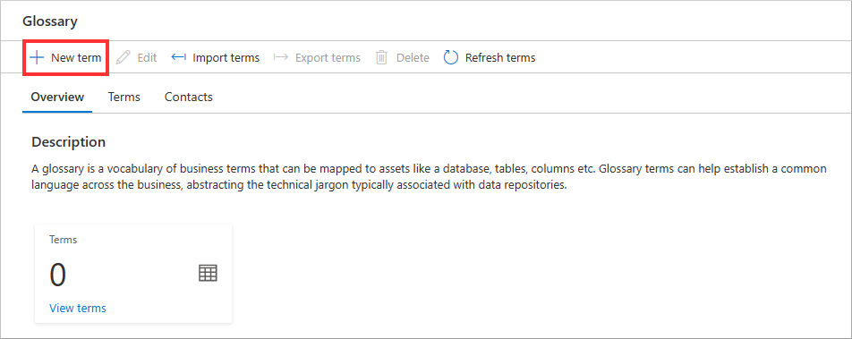

3. Select the **System default** term template and click **Continue**.

    > :bulb: **Did you know?**
    >
    > A **Term Template** determines the attributes for a term. The **System default** term template has basic fields only (e.g. Name, Definition, Status, etc). **Custom** term templates on the other hand, can be used to capture additional custom attributes. For more information, check out [How to manage term templates for business glossary](https://docs.microsoft.com/azure/purview/how-to-manage-term-templates).

    

4. Change the **Status** of the term to `Approved` and then **copy** and **paste** the values below into the appropriate field, then click **Create**.

    

    **Name**

    ```text
    Contoso Parent
    ```

    **Definition**

    ```text
    This will be the parent term.
    ```

    **Acronym**

    ```text
    CP
    ```

    **Resource Name**

    ```text
    Microsoft Purview
    ```

    **Resource Link**

    ```text
    https://aka.ms/Azure-Purview
    ```

<div align="right"><a href="#module-04---glossary">↥ back to top</a></div>

## 2. Create a Term (Custom Term Template)

1. Open the **Microsoft Purview Governance Portal** and from the **Data catalog**, click **Glossary**.

    

2. Click **New term**.

    

3. Click **New term template**.

    

4. Specify a **Template name** (e.g. `Contoso Template`) and click **New attribute**.

    

5. Populate the attribute fields as per the examples below and click **Apply**.

    | Field  | Example Value |
    | --- | --- |
    | Attribute name | `Business Unit` |
    | Field type | `Single choice` |
    | Choices | `Sales`, `Marketing`, `Finance`, `Human Resources`, `IT`, |

    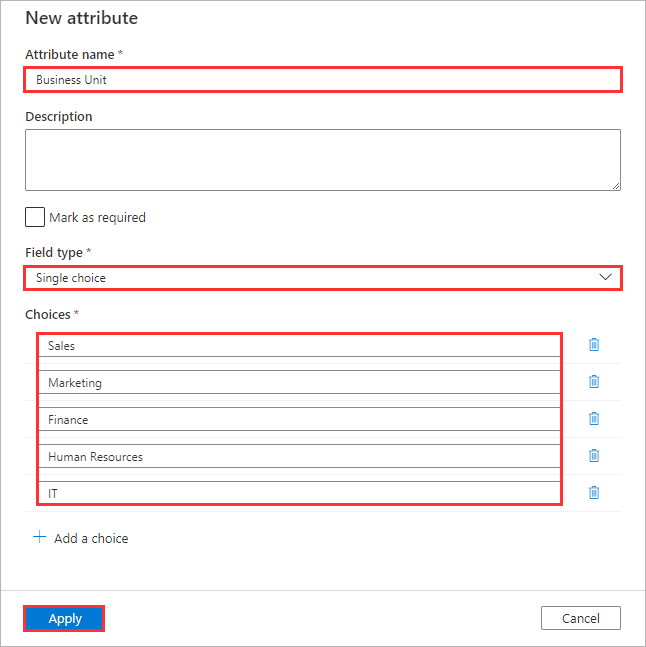

6. Click **Create**.

    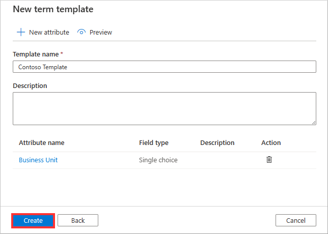

7. Select **Contoso Template** and click **Continue**.

    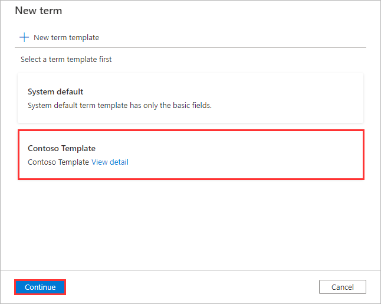

8. Change the **Status** of the term to `Approved` and then **copy** and **paste** the values below into the appropriate field, then click **Create**.

    

    **Name**

    ```text
    Contoso Child
    ```

    **Definition**

    ```text
    This will be the long description for the child glossary term.
    ```

    **Parent**

    ```text
    Contoso Parent
    ```

    **Business Unit**

    ```text
    Marketing
    ```

9. From the **Glossary** screen, change the view to **Hierarchical view** to see the hierarchical glossary.

    

<div align="right"><a href="#module-04---glossary">↥ back to top</a></div>

## 3. Bulk Import Terms

1. Download a copy of **[import-terms-sample.csv](https://github.com/tayganr/purviewlab/raw/main/assets/import-terms-sample.csv)** to your local machine by opening the link in a new tab, right-click within the body of the content, click **Save as** .

    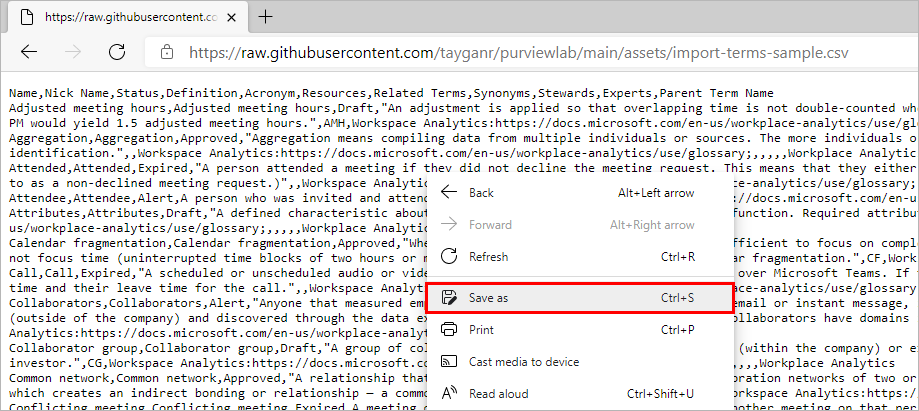

2. From the **Glossary** screen, click **Import terms**.

    

3. Select the **System default** term template and click **Continue**.

    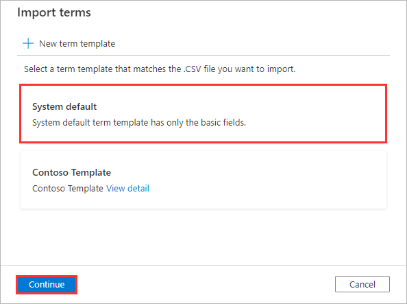

4. Click **Browse** and open the local copy of **import-terms-sample.csv**.

    

5. Click **OK**.

    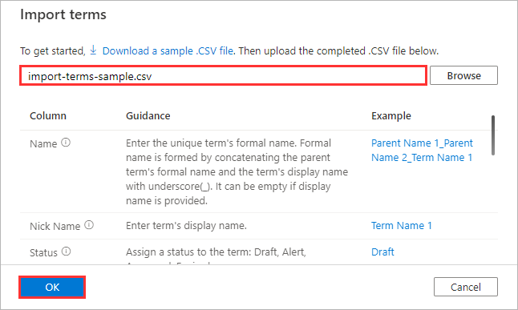

6. Once complete, you should see 50 additional terms beneath the parent (Workplace Analytics). **Tip**: You can quickly find specific types of terms using the filters at the top (e.g. Status = Approved).

    

<div align="right"><a href="#module-04---glossary">↥ back to top</a></div>

## 4. Bulk Export Terms

1. From the **Glossary** screen, we want to select ALL terms (top check box) and then de-select terms that do not belong to Workplace Analytics (i.e. Contoso Parent, Contoso Child). **All Workplace Analytics terms** should be selected. Click **Export terms**. Note: You can not export terms from different term templates.

    > :bulb: **Did you know?**
    >
    > When using the Microsoft Purview Governance Portal to **Export terms**, all terms selected for the export must use the same **Term template**. Selecting terms from different term templates will result in the **Export terms** button being greyed out.

    

2. If the export was successful, you should find a **CSV** file has been copied to your local machine (e.g. Downloads).

    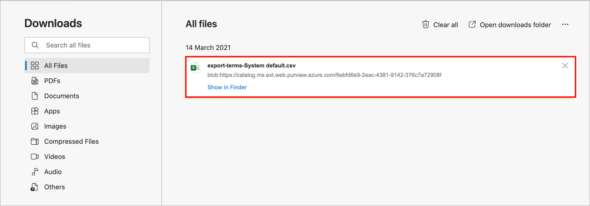

<div align="right"><a href="#module-04---glossary">↥ back to top</a></div>

## 5. Assign a Term to an Asset

1. Perform a wildcard search by typing asterisk (**\***) into the search bar and hitting the Enter key to submit the query. Click on an asset title (e.g. `QueriesByState`) to view the details.

    

2. Click **Edit**.

    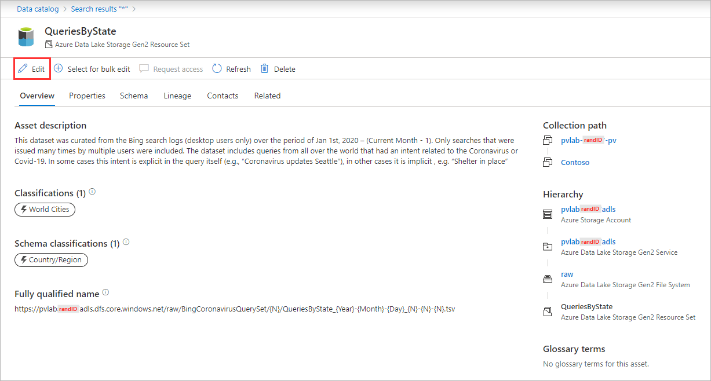

3. Open the **Glossary terms** drop-down menu and select a glossary term (e.g. `Contoso Child`). Click **Save**.

    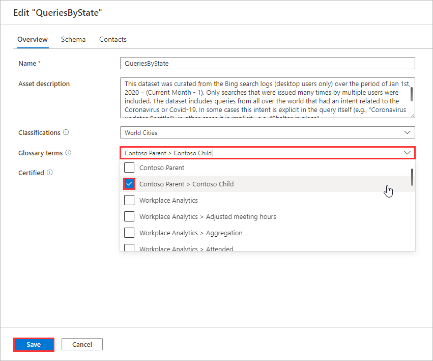

4. Click on the hyperlinked term name to view the glossary term details.

    

5. Click **Refresh** to view the **Catalog assets** the term is assigned to.

    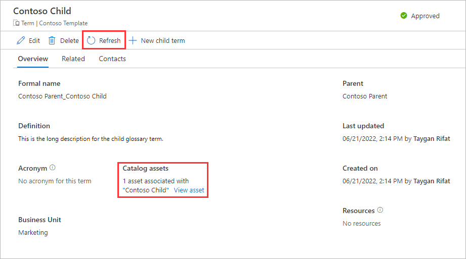

<div align="right"><a href="#module-04---glossary">↥ back to top</a></div>

## 6. Update an Existing Term

1. From the **Glossary** screen, open an existing term (e.g. `Aggregation`).

    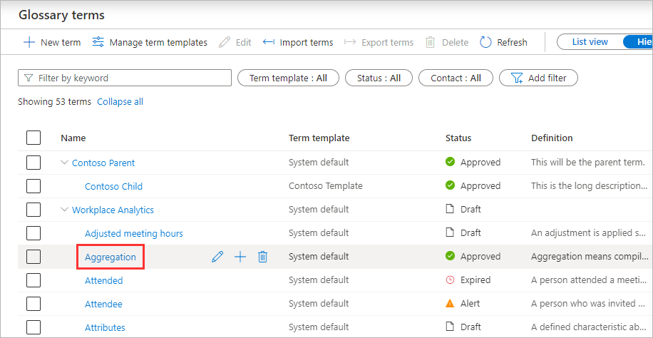

2. Navigate to the **Related** tab and click **Edit**.

    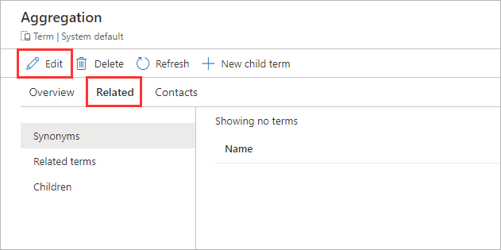

3. Use the drop-down menu to assign two glossary terms as **Synonyms**.

    > :bulb: **Did you know?**
    >
    > **Synonyms** are other terms with the same or similar definitions. Where as **Related terms** are other terms that are related but have different definitions.

    

4. Use the drop-down menu to assign two glossary terms as **Related terms**.

    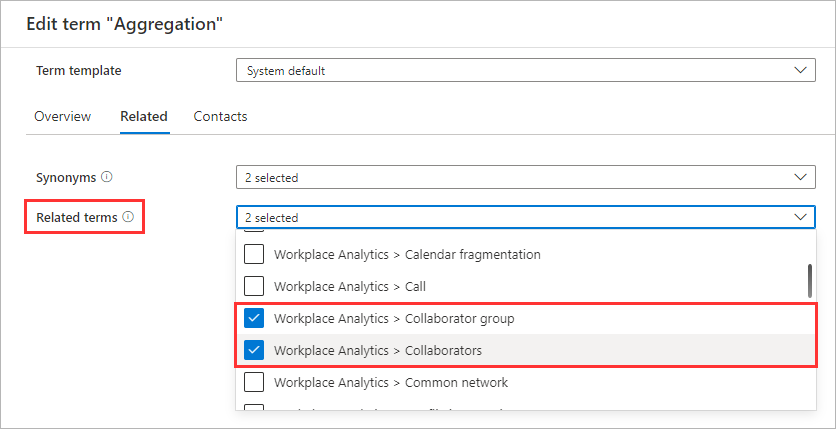

5. Navigate to the **Contacts** tab and assign an **Expert** and a **Steward**. Click **Save**.

    > :bulb: **Did you know?**
    >
    > Glossary terms can be related to two different types of contacts. **Experts** are typically business process or subject matter experts. Where as **Stewards** define the standards for a data object or business term. They drive quality standards, nomenclature, rules.

    

<div align="right"><a href="#module-04---glossary">↥ back to top</a></div>

## :mortar_board: Knowledge Check

[https://aka.ms/purviewlab/q04](https://aka.ms/purviewlab/q04)

1. Glossary terms with the same name but different descriptions can exist under the same parent term?

    A ) True  
    B ) False 

2. Glossary terms can be related to other terms in the glossary. Which of the following is **not** a valid glossary term relationship type?

    A ) Synonyms  
    B ) Antonyms  
    C ) Related terms  

3. Glossary terms created using different term templates can be exported together using the the Microsoft Purview Governance Portal (UI) glossary "Export terms" functionality?

    A ) True  
    B ) False  

<div align="right"><a href="#module-04---glossary">↥ back to top</a></div>

## :tada: Summary

This module provided an overview of how to create, export, and import terms into the Microsoft Purview glossary.

[Continue >](../modules/module05.md)
