# Module 04 - Glossary

[< Previous Module](../modules/module03.md) - **[Home](../README.md)** - [Next Module>](../modules/module05.md)

## :thinking: Prerequisites

* An Azure account with an active subscription.
* An Azure Azure Purview account (see [module 01](../modules/module01.md)).

## :loudspeaker: Introduction

A glossary is an important tool for maintaining and organizing your catalog. You build your glossary by defining new terms or importing a term list and then applying those terms to your assets.

## :dart: Objectives

* Create a Term in the Glossary using the System Default Term Template.
* Create a Term in the Glossary using a Custom Term Tempalte.
* Bulk Import Terms into the Glossary via a CSV file.
* Bulk Export Terms from the Glossary into a CSV file.
* Assign a Term to an Asset in the Data Catalog.

## Table of Contents

1. [Create a Term (System Default Term Template)](#1-create-a-term-system-default-term-template)
2. [Create a Term (Custom Term Template)](#2-create-a-term-custom-term-template)
3. [Bulk Import Terms](#3-bulk-import-terms)
4. [Bulk Export Terms](#4-bulk-export-terms)
5. [Assign a Term to an Asset](#5-assign-a-term-to-an-asset)

<a href="#module-04---glossary">↥ back to top</a>

## 1. Create a Term (System Default Term Template)

1. Open Purview Studio and from the **Glossary** screen, click **New term**.

    

2. Select the **System default** term template and click **Continue**.

    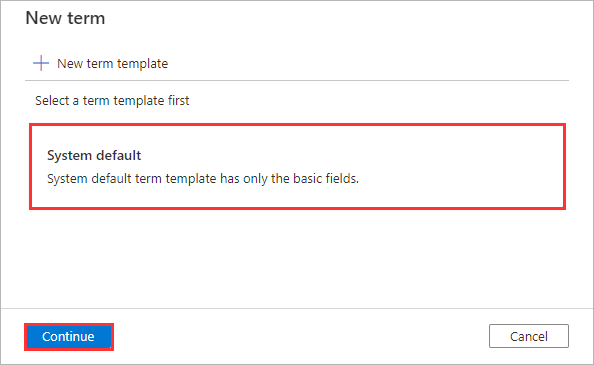

3. Populate the term fields as per the examples below and click **Create**.

    | Field  | Example Value |
    | --- | --- |
    | Status | `Approved` |
    | Name | `Contoso Parent` |
    | Definition | `This will be the parent term.` |
    | Acronym | `CP` |
    | Resource Name | `Azure Purview` |
    | Resource Link | `https://aka.ms/Azure-Purview` |

    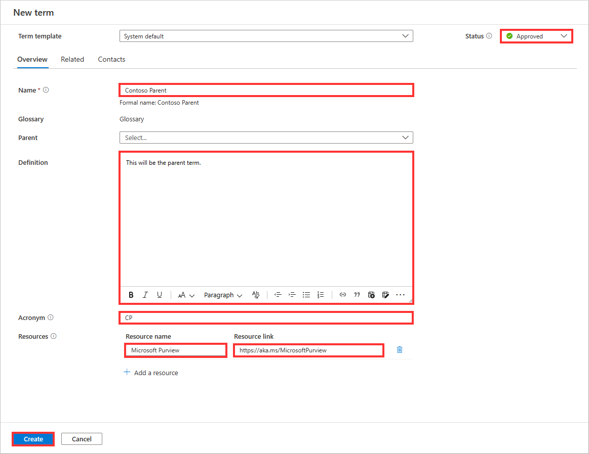

<a href="#module-04---glossary">↥ back to top</a>

## 2. Create a Term (Custom Term Template)

1. Open Purview Studio and from the **Glossary** screen, click **New term**.

    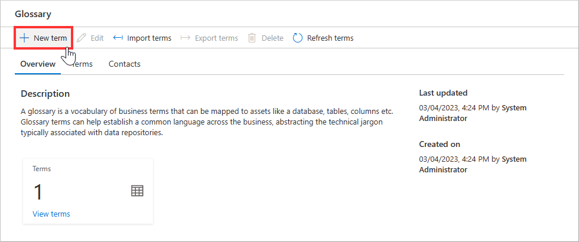

2. Click **New term template**.

    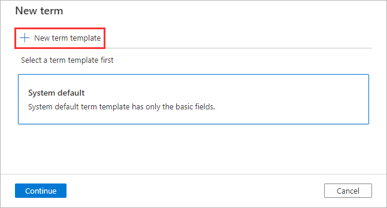

3. Provide the Term Template a **Name** (e.g. `Contoso Template`) and click **New attribute**.

    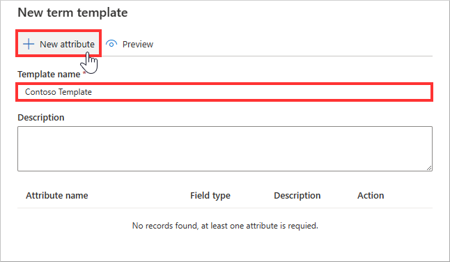

4. Provide the Attribute a **Name** (e.g. `Business Unit`), set **Field Type** to **Single Choice** and populate with values (e.g. `Sales`, `Marketing`, `Finance`, `IT`). Click **Apply**.

    

5. Click **Create**.

    

6. Select **Contoso Template** and click **Continue**.
    
    

9. Populate the term fields as per the examples below and click **Create**.

    | Field  | Example Value |
    | --- | --- |
    | Status | `Approved` |
    | Name | `Contoso Child` |
    | Definition | `This will be the long description for the child glossary term.` |
    | Business Unit | `Marketing` |

    

10. From the **Glossary** screen, change the view to **Hierarchical view** to see the hierarchal glossary.

    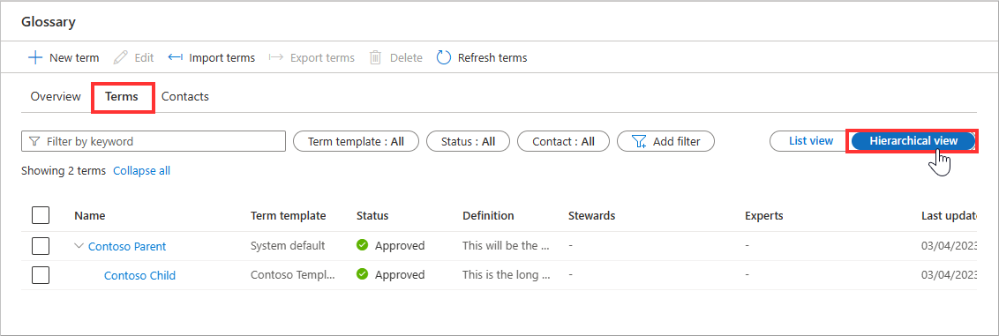

<a href="#module-04---glossary">↥ back to top</a>

## 3. Bulk Import Terms

1. Download a copy of **[import-terms-sample.csv](https://github.com/tayganr/purviewlab/raw/main/assets/import-terms-sample.csv)** to your local machine.

2. From the **Glossary** screen, click **Import terms**.

    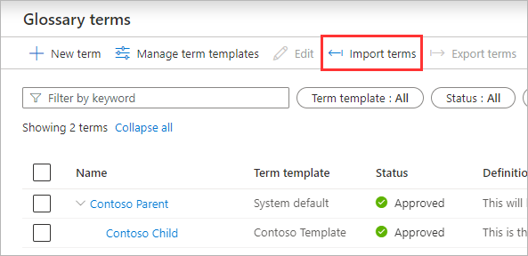

3. Selec the **System default** term template and click **Continue**.

    

4. Click **Browse** and open the local copy of **[import-terms-sample.csv](https://github.com/tayganr/purviewlab/raw/main/assets/import-terms-sample.csv)**.

    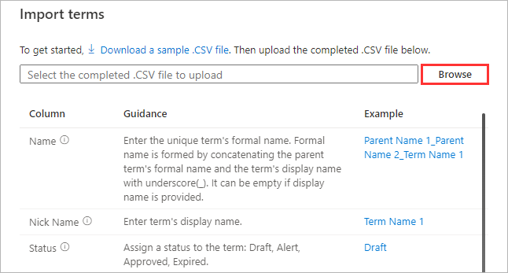

5. Click **OK**.

    

6. Once complete, you should see 50 additional terms beneath the parent (Workplace Analytics). :bulb: **Tip**: You can quickly find specific types of terms using the filters at the top (e.g. Status = Approved).

    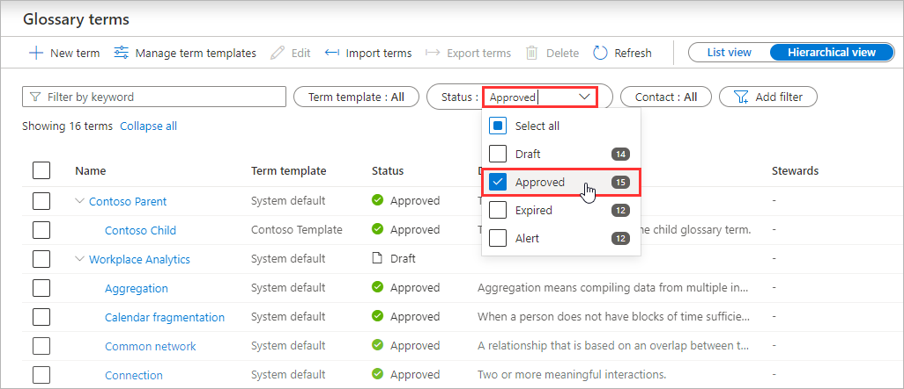

<a href="#module-04---glossary">↥ back to top</a>

## 4. Bulk Export Terms

1. From the **Glossary** screen, we want to select ALL terms (top check box) and then de-select terms that do not belong to Workplace Analytics (i.e. Contoso Parent, Contoso Child). **All Workplace Analytics terms** should be selected. Click **Export terms**.

    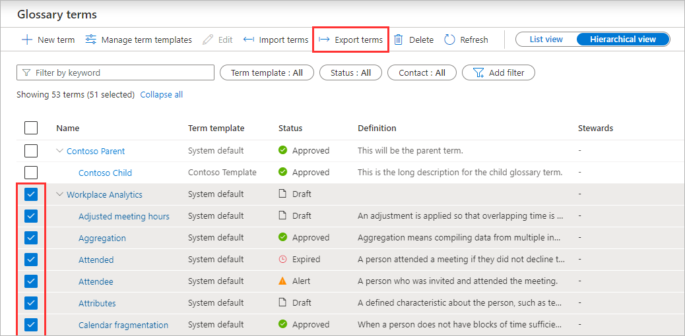

2. If the export was successful, you should find a **CSV** file has been copied to your local machine (e.g. Downloads).

    

<a href="#module-04---glossary">↥ back to top</a>

## 5. Assign a Term to an Asset

1. Perform a wildcard search by typing asterik (**\***) into the search bar and hitting **Enter** to submit the query. Click on an asset title (e.g. `QueriesByState`) to view the details.

    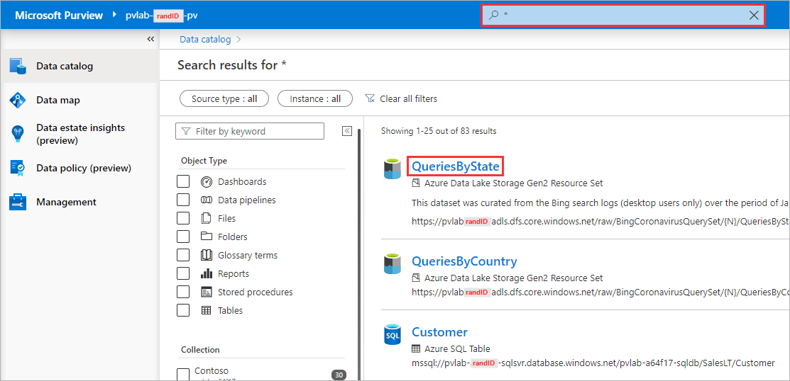

2. Click **Edit**.

    

3. Open the **Glossary terms** drop-down and select a glossary term (e.g. `Contoso Child`). Click **Save**.

    

4. Click on the hyperlinked term name to view the glossary term details.

    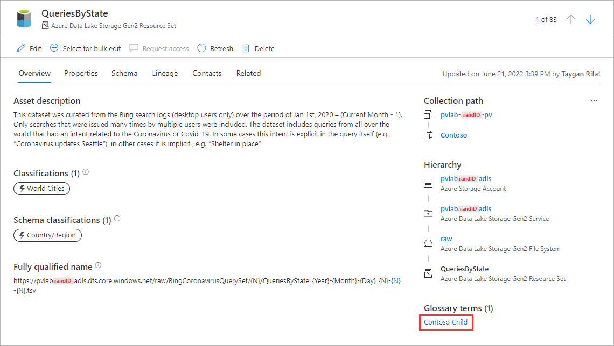

5. Click **Refresh** to view the **Catalog assets** the term is assigned to.

    

<a href="#module-04---glossary">↥ back to top</a>

## :mortar_board: Knowledge Check

1. Glossary terms with the same name but different descriptions can exist under the same parent term?

    A ) True  
    B ) False 

2. Glossary terms with the same name can exist as long as each instance has a unique parent term?

    A ) True  
    B ) False  

3. Glossary terms created using different term templates can be exported together using the Purview Studio (UI) glossary "Export terms" functionality?

    A ) True  
    B ) False  

<a href="#module-04---glossary">↥ back to top</a>

## :tada: Summary

This module provided an overview of how to create, export, and import terms into the Azure Purview glossary.
