# Module 05 - Classifications

[< Previous Module](../modules/module04.md) - **[Home](../README.md)** - [Next Module>](../modules/module06.md)

## :thinking: Prerequisites

* An Azure account with an active subscription.
* An Azure Azure Purview account (see [module 01](../modules/module01.md)).
* An Azure Data Lake Storage Gen2 Account (see [module 02](../modules/module02.md)).

## :hammer: Tools

* [Azure Storage Explorer](https://azure.microsoft.com/en-us/features/storage-explorer/)

## Table of Contents

1. [Create a Classification](#1-create-a-classification)
2. [Create a Classification Rule (Regular Expression)](#2-create-a-custom-classification-rule-regular-expression)
3. [Create a Scan Rule Set](#3-create-a-scan-rule-set)
4. [Upload Data to an Azure Data Lake Storage Gen2 Account](#4-upload-data-to-an-azure-data-lake-storage-gen2-account)
5. [Scan an Azure Data Lake Storage Gen2 Account](#5-scan-an-azure-data-lake-storage-gen2-account)
6. [Search by Classification](#6-search-by-classification)

<a href="#module-05---classifications">↥ back to top</a>

## 1. Create a Classification

1. Open Purview Studio, navigate to **Management Center** > **Classifications** (under Metadata management) and click **New**.

    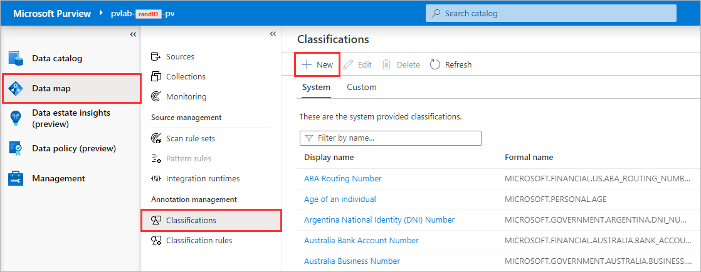

2. Populate the classification fields as per the example below and click **OK**.

    | Field  | Example Value |
    | --- | --- |
    | Name | `Twitter_Handle` |
    | Description | `The username that appears at the end of your unique Twitter URL.` |

    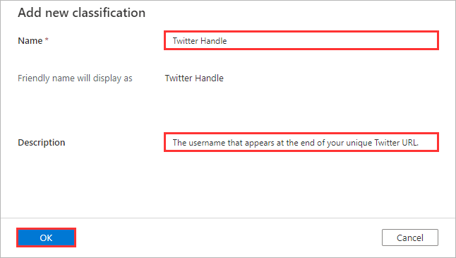

<a href="#module-05---classifications">↥ back to top</a>

## 2. Create a Custom Classification Rule (Regular Expression)

1. Navigate to **Management Center** > **Classification rules** (under Metadata management) and click **New**.

    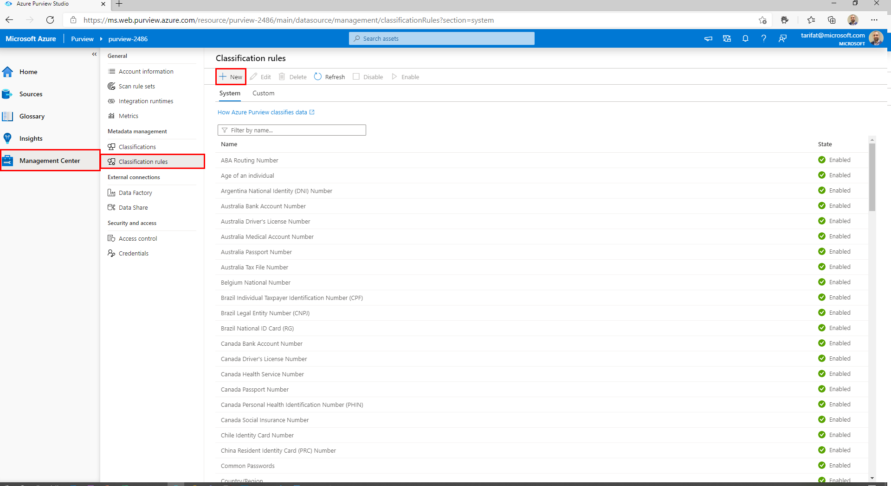

2. Populate the classification rule fields as per the example below and click **Continue**.

    | Field  | Example Value |
    | --- | --- |
    | Name | `Twitter_Handle` |
    | Description | `The username that appears at the end of your unique Twitter URL.` |
    | Classification name | `Twitter_Handle` |
    | State | `Enabled` |
    | Type | `Regular Expression` |

    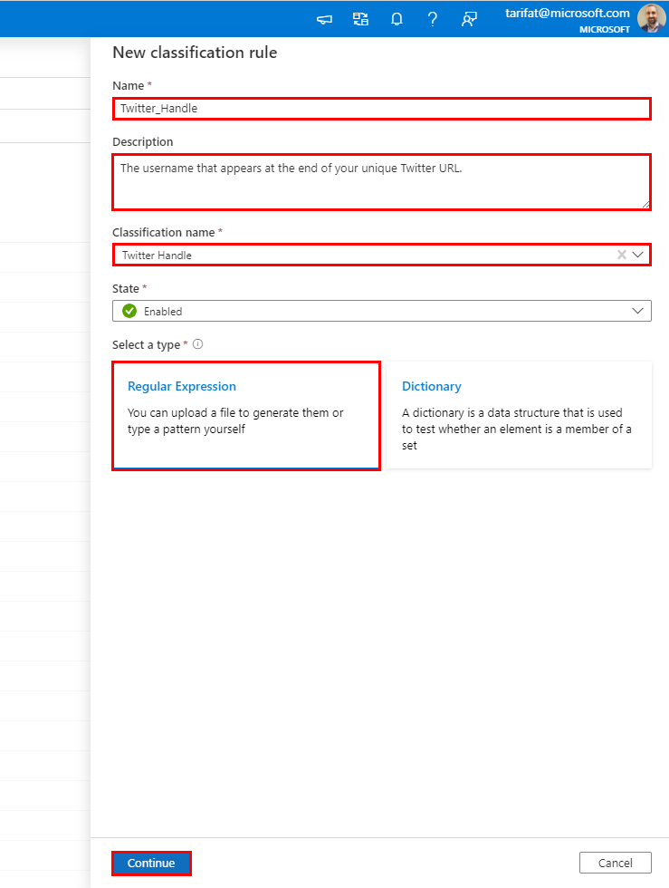

3. Download a copy of **[twitter_handles.csv](https://github.com/tayganr/purviewlab/raw/main/assets/twitter_handles.csv)** to your local machine.

4. Click the **Browse** icon and open the local copy of **[twitter_handles.csv](https://github.com/tayganr/purviewlab/raw/main/assets/twitter_handles.csv)**.

5. Select the data pattern associated to the **Handle** column and click **Add to patterns**.

    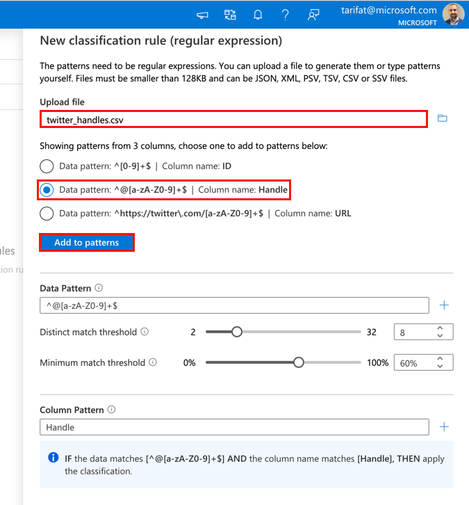

6. Modify the Data Pattern by replacing the plus sysmbol (`+`) with with `{5,15}`.

    * The plus sysmbol (`+`) indicates one or more characters matching the preceding item. This may lead to false positives as it would allow for an unlimited number of alphanumeric characters. Twitter handles must be a minimum of 5 and a maximum of 15 characters.
    * With `{5,15}`, this will ensure matches only occur where there is a at least 5 and at most 15 occurences of the preceding item.

7. While we can also specify a **Column Pattern**, in this example we will rely solely on the Data Pattern. Clear the **Column Pattern** input and click **Create**.

    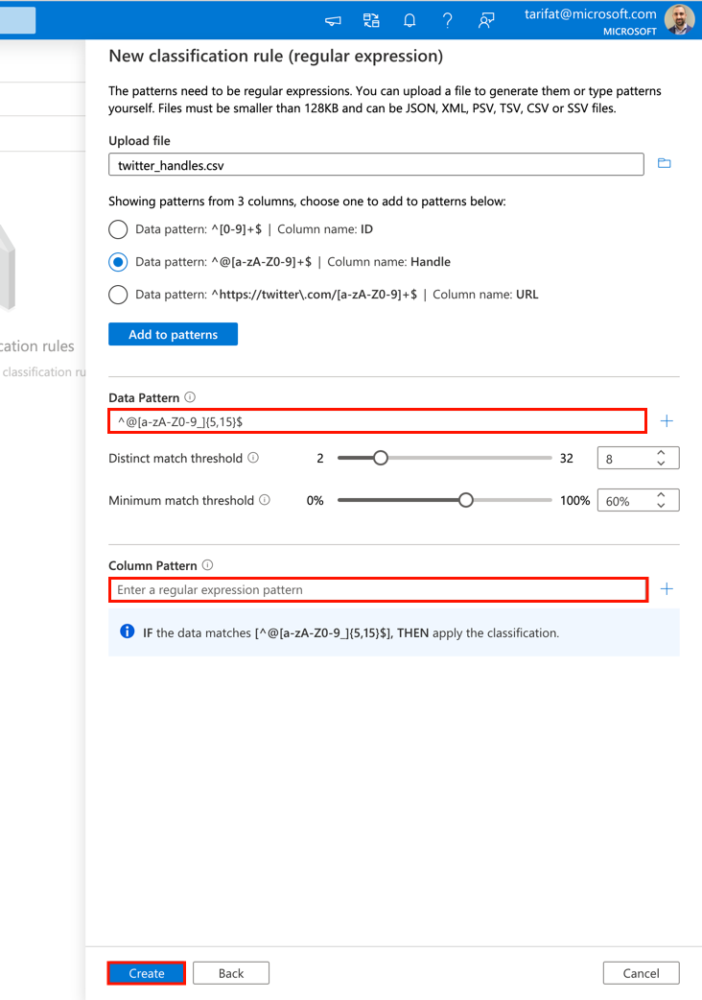

<a href="#module-05---classifications">↥ back to top</a>

## 3. Create a Scan Rule Set

1. Navigate to **Management Center** > **Scan rule sets** (under General) and click **New**.

    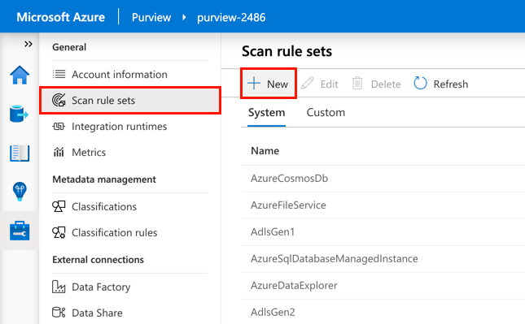

2. Populate the scan rule set fields as per the example below and click **Continue**.

    | Field  | Example Value |
    | --- | --- |
    | Source Type | `Azure Data Lake Storage Gen2` |
    | Scan rule set name | `twitter_scan_rule_set` |
    | Scan rule description | `Custom scan rule set to detect parquet files and classify twitter handles.` |

    

3. Clear all file type selections with the exception of **PARQUET** and click **Continue**.

    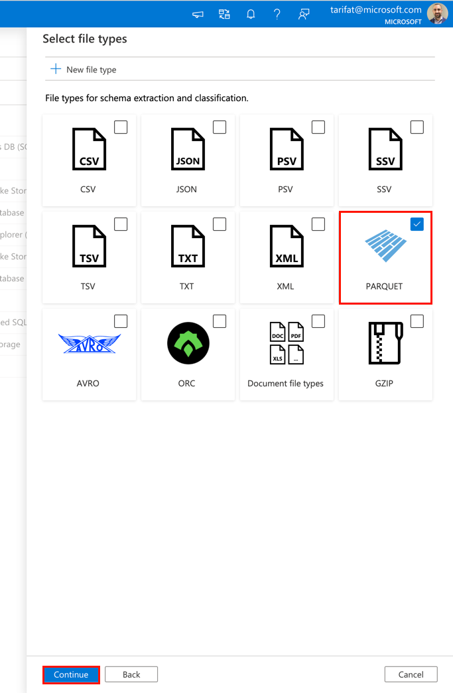

4. Clear all selected System rules and select the custom classification rule **Twitter_Handle** and click **Create**.

    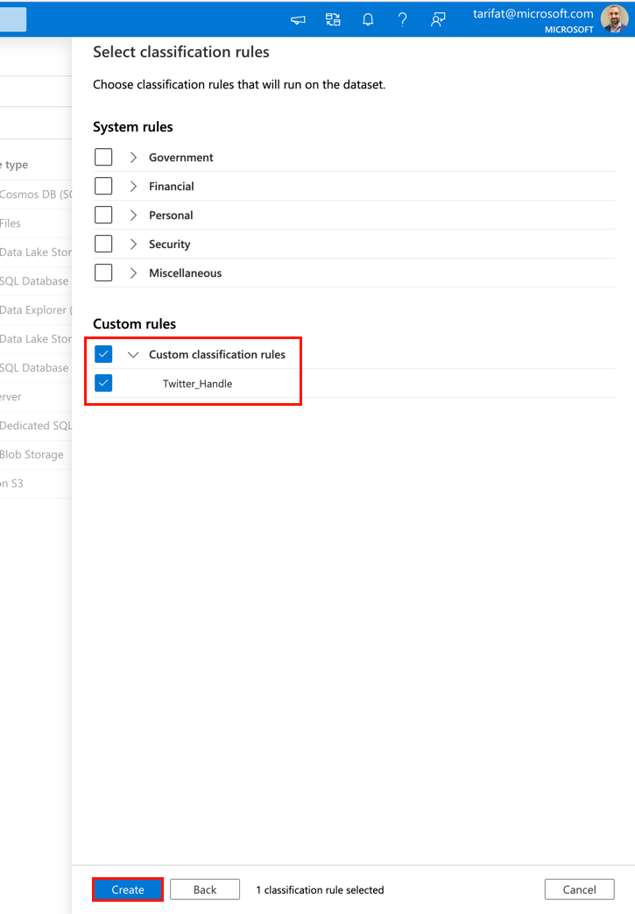

<a href="#module-05---classifications">↥ back to top</a>

## 4. Upload Data to an Azure Data Lake Storage Gen2 Account

Before proceeding with the following steps, you will need to:
* Download and install [Azure Storage Explorer](https://azure.microsoft.com/en-us/features/storage-explorer/).
* Open Azure Storage Explorer.
* Sign in to Azure via **View > Account Management > Add an account...**.

Note: If you have not created an Azure Data Lake Stroage Gen2 Account, see [module 02](../modules/module02.md).

1. Download a copy of **[twitter_handles.parquet](https://github.com/tayganr/purviewlab/raw/main/assets/twitter_handles.parquet)** to your local machine. 

1. Navigate to your Azure Data Lake Storage Gen2 Account, expand **Blob Containers**, and **Open** the **raw** container. Note: If a raw container does not exist, create one.

    

2. Click on the **New Folder** button, provide the folder a name (e.g. `Twitter`) and click **OK**.

    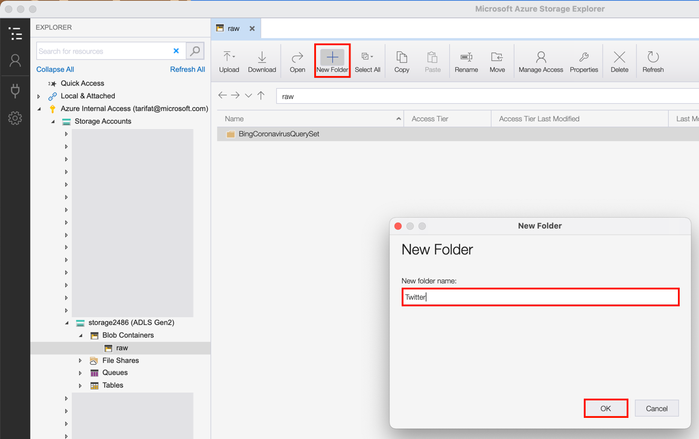

3. Click on the **Upload** button and select **Upload Files...**.

    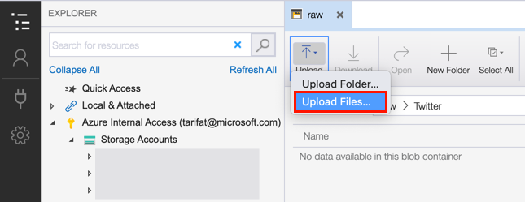

4. Select the local copy of **[twitter_handles.parquet](https://github.com/tayganr/purviewlab/raw/main/assets/twitter_handles.parquet)** and click **Upload**.

    

<a href="#module-05---classifications">↥ back to top</a>

## 5. Scan an Azure Data Lake Storage Gen2 Account

1. Open Purview Studio, navigate to **Sources** and click **New Scan**. Note: If you have not registered your Azure Data Lake Storage Gen2 Account, see [module 02](../modules/module02.md).

    

2. Click **Test connection** to ensure the credentials have access and click **Continue**.

    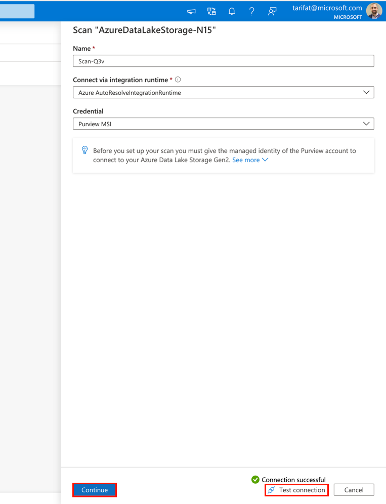

3. By default, Azure Purview will have the parent Azure Data Lake Storage Gen2 account selected and therefore include all paths in scope. To reduce the scope, deselect the parent and select the **Twitter** folder only.

    

4. To validate the scope of the custom scan rule set, click **View detail**.

    

5. Confirm that the custom scan rule set includes the **PARQUET** file type and the custom classification rule **Twitter_Handle**. Click **OK**.

    

6. Select the custom scan rule set **twitter_scan_rule_set** and click **Continue**.

    

7. Set the scan trigger to **Once** and click **Continue**.

    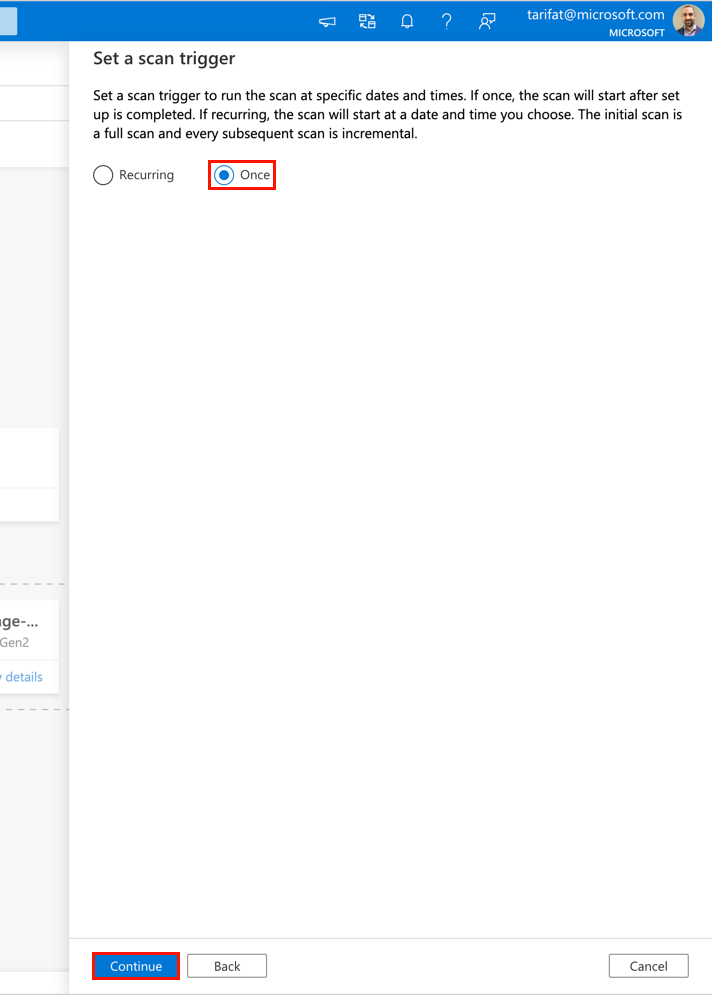

8. Click **Save and Run**.

    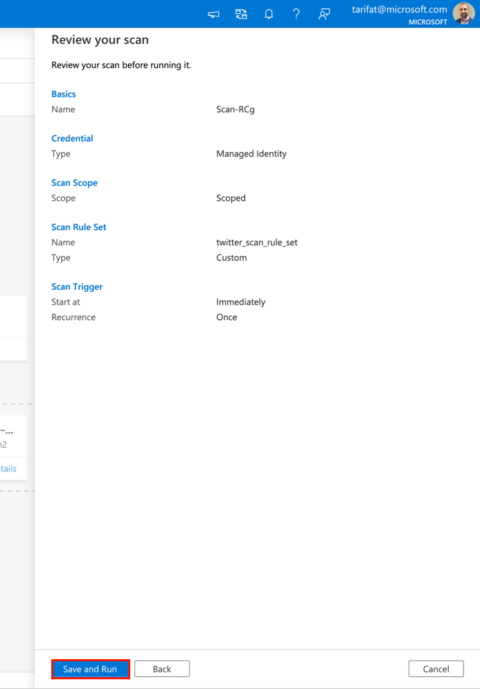

9. To view the progress of the scan, navigate to **Sources** and click **View details** on the Azure Data Lake Storage Gen2 account.

    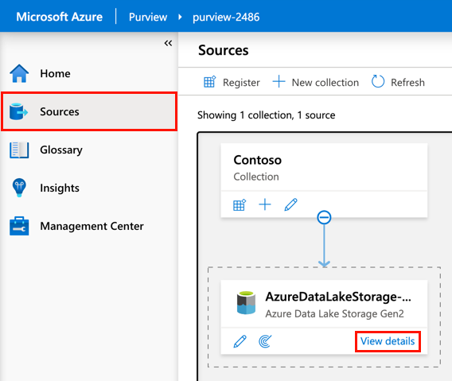

10. Periodically click **Refresh** to update the scan status until **Complete**. Note: This will take approximately 5 minutes.

    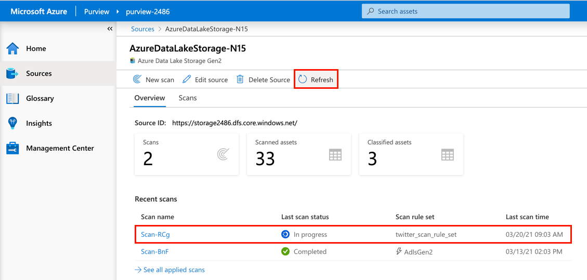

<a href="#module-05---classifications">↥ back to top</a>

## 6. Search by Classification

1. Once the scan has complete, perform a wildcard search by typing in the asterik character (**\***) into the search bar and hit Enter.

    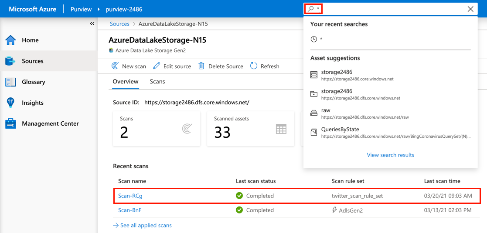

2. Limit the search results by setting **Classification** within the filter panel to **Twitter Handle**. Click on the asset title (**twitter_handles.parquet**) to view the asset details.

    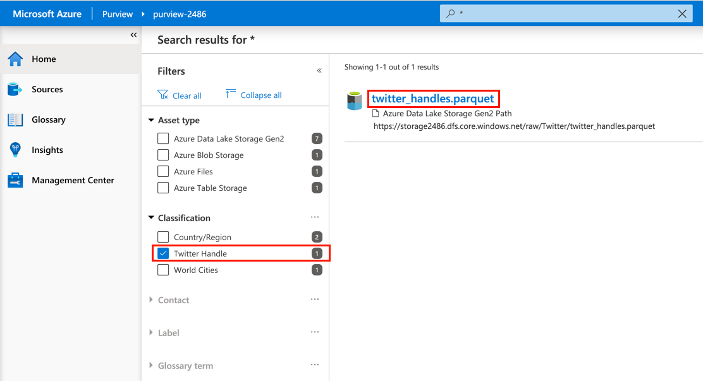

3. You will notice on the Overview tab that the schema includes the Twitter Handle classification. To identity which column has been classified, navigate to the **Schema** tab.

    

4. Within the Schema tab we can see that **Account name** is the column that has been classified.

    

<a href="#module-05---classifications">↥ back to top</a>

## :tada: Summary

This module provided an overview of how to create a custom classification, and how to have the classification automatically applied as part of a scan using a custom scan rule set.
