# Module 05 - Classifications

[< Previous Module](../modules/module04.md) - **[Home](../README.md)** - [Next Module >](../modules/module06.md)

## :loudspeaker: Introduction

In Microsoft Purview, classifications are similar to subject tags, and are used to mark and identify data of a specific type that's found within your data estate during scanning. Classifications help you to better manage your data. You can use them for prioritizing your data efforts or improve data security and regulatory compliance. Classifications also improve user productivity and decision-making, and allow you to reduce costs by classifying and finding unused data.

Microsoft Purview provides a large set of default classifications that represent typical data types that might exist in your data estate (e.g. email address, credit card number, passport number, etc). In this module you learn how to create a custom classification, which can be an alternative to default classifications when they don't meet your needs.

## :thinking: Prerequisites

* An [Azure account](https://azure.microsoft.com/free/) with an active subscription.
* An Azure Data Lake Storage Gen2 Account (see [module 00](../modules/module00.md)).
* A Microsoft Purview account (see [module 01](../modules/module01.md)).

## :hammer: Tools

* [Azure Storage Explorer](https://azure.microsoft.com/features/storage-explorer/)

## :dart: Objectives

* Create a custom classification.
* Trigger a scan that will apply the custom classification to an asset.

## Table of Contents

1. [Create a Classification](#1-create-a-classification)
2. [Create a Classification Rule (Regular Expression)](#2-create-a-custom-classification-rule-regular-expression)
3. [Create a Scan Rule Set](#3-create-a-scan-rule-set)
4. [Upload Data to an Azure Data Lake Storage Gen2 Account](#4-upload-data-to-an-azure-data-lake-storage-gen2-account)
5. [Scan an Azure Data Lake Storage Gen2 Account](#5-scan-an-azure-data-lake-storage-gen2-account)
6. [Search by Classification](#6-search-by-classification)

<div align="right"><a href="#module-05---classifications">↥ back to top</a></div>

## 1. Create a Classification

1. Open the **Microsoft Purview Governance Portal**, navigate to **Data map** > **Classifications** (under Annotation management) and click **New**.

    

2. **Copy** and **paste** the values below into the appropriate fields and click **OK**.

    **Name**
    ```
    Twitter Handle
    ```
    **Description**
    ```
    The username that appears at the end of your unique Twitter URL.
    ```

    

3. Navigate to the **Custom** tab to confirm the custom classification has been created.

    

<div align="right"><a href="#module-05---classifications">↥ back to top</a></div>

## 2. Create a Custom Classification Rule (Regular Expression)

1. Navigate to **Data map** > **Classification rules** (under Annotation management) and click **New**.

    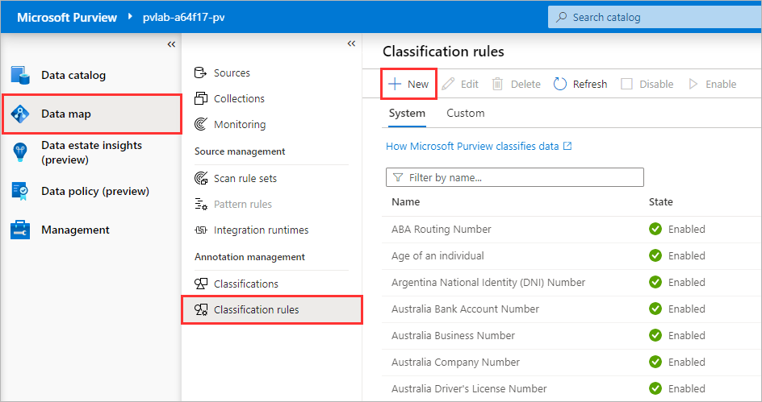

2. Populate the classification rule fields as per the example below and click **Continue**.

    | Field  | Example Value |
    | --- | --- |
    | Name | `twitter_handle` |
    | Description | `The username that appears at the end of your unique Twitter URL.` |
    | Classification name | `Twitter Handle` |
    | State | `Enabled` |
    | Type | `Regular Expression` |

    > :bulb: **Did you know?**
    >
    > There are two types of classification rules. **Regular Expression** performs pattern matching against the actual data and/or column name. Where as **Dictionary** based classification rules allows us to supply a list of all possible values via a CSV or TSV file.

    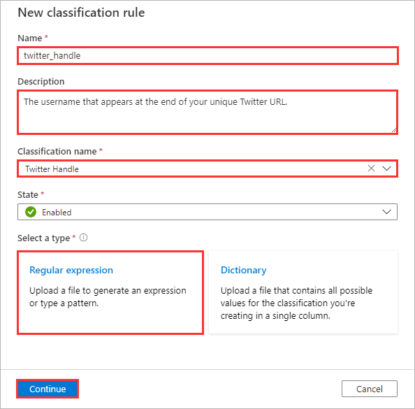

3. Download a copy of **[twitter_handles.csv](https://github.com/tayganr/purviewlab/raw/main/assets/twitter_handles.csv)** to your local machine by opening the link in a new tab, right-click within the body of the content, and click **Save as**.

    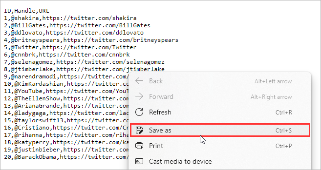

4. Click the **Browse** icon and open the local copy of **twitter_handles.csv**.

    

5. Select the data pattern associated to the **Handle** column and click **Add to patterns**.

    > :bulb: **Did you know?**
    >
    > **Thresholds** help minimise the possibility of false-positive classifications. **Minimum match threshold** is the minimum percentage of data value matches in a column that needs to be found by the scanner for the classification to be applied.

    

6. Modify the Data Pattern by replacing the plus symbol (`+`) with with `{5,15}`.

    * The plus symbol (`+`) indicates one or more characters matching the preceding item. This may lead to false positives as it would allow for an unlimited number of alphanumeric characters. Twitter handles must be a minimum of 5 and a maximum of 15 characters.
    * With `{5,15}`, this will ensure matches only occur where there is a at least 5 and at most 15 occurrences of the preceding item.

    

7. While we can also specify a **Column Pattern**, in this example we will rely solely on the Data Pattern. Clear the **Column Pattern** input and click **Create**.

    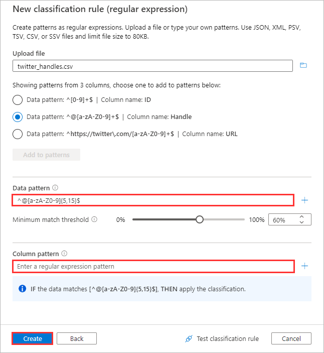

<div align="right"><a href="#module-05---classifications">↥ back to top</a></div>

## 3. Create a Scan Rule Set

1. Navigate to **Data map** > **Scan rule sets** (under Source management) and click **New**.

    > :bulb: **Did you know?**
    >
    > **Scan Rule Sets** determine which **File Types** and **Classification Rules** are in scope. If you want to include a custom file type or custom classification rule as part of a scan, a custom scan rule set will need to be created.

    

2. Change the **Source Type** to `Azure Data Lake Storage Gen2` then **copy** and **paste** the values below into the appropriate fields. Click **Continue**.

    **Scan rule set name**

    ```text
    twitter_scan_rule_set
    ```

    **Scan rule description**

    ```text
    Custom scan rule set to detect parquet files and classify twitter handles.
    ```

    

3. Clear all file type selections with the exception of **PARQUET** and click **Continue**.

    

4. Clear all selected **System rules** and select the custom classification rule **twitter_handle** and click **Continue**.

    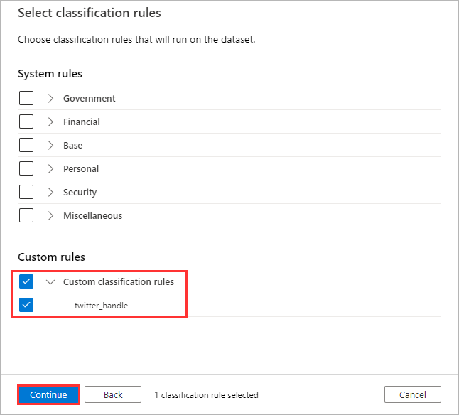

5. Click **Create**.

    > :bulb: **Did you know?**
    >
    > **Ignore patterns** tell Microsoft Purview which assets to exclude during scanning. During scanning, Microsoft Purview will compare the asset's URL against these regular expressions. All assets matching any of the regular expressions mentioned will be ignored while scanning.

    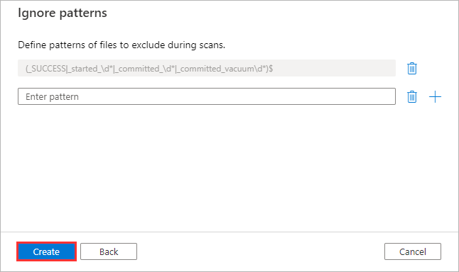

<div align="right"><a href="#module-05---classifications">↥ back to top</a></div>

## 4. Upload Data to an Azure Data Lake Storage Gen2 Account

Before proceeding with the following steps, you will need to:

* Download and install [Azure Storage Explorer](https://azure.microsoft.com/features/storage-explorer/).
* Open Azure Storage Explorer.
* Sign in to Azure via **View > Account Management > Add an account...**.

Note: If you have not created an Azure Data Lake Storage Gen2 Account, see [module 02](../modules/module02.md).

1. Download a copy of **[twitter_handles.parquet](https://github.com/tayganr/purviewlab/raw/main/assets/twitter_handles.parquet)** to your local machine by opening the link in a new tab, right-click within the body of the content, and click **Save as**. 

2. Navigate to your Azure Data Lake Storage Gen2 Account, expand **Blob Containers**, and **Open** the **raw** container. Note: If a raw container does not exist, create one.

    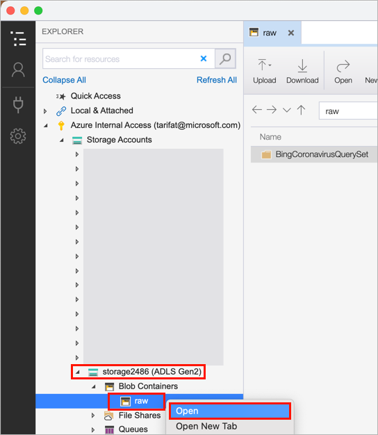

3. Click on the **New Folder** button, provide the folder a name (e.g. `Twitter`) and click **OK**.

    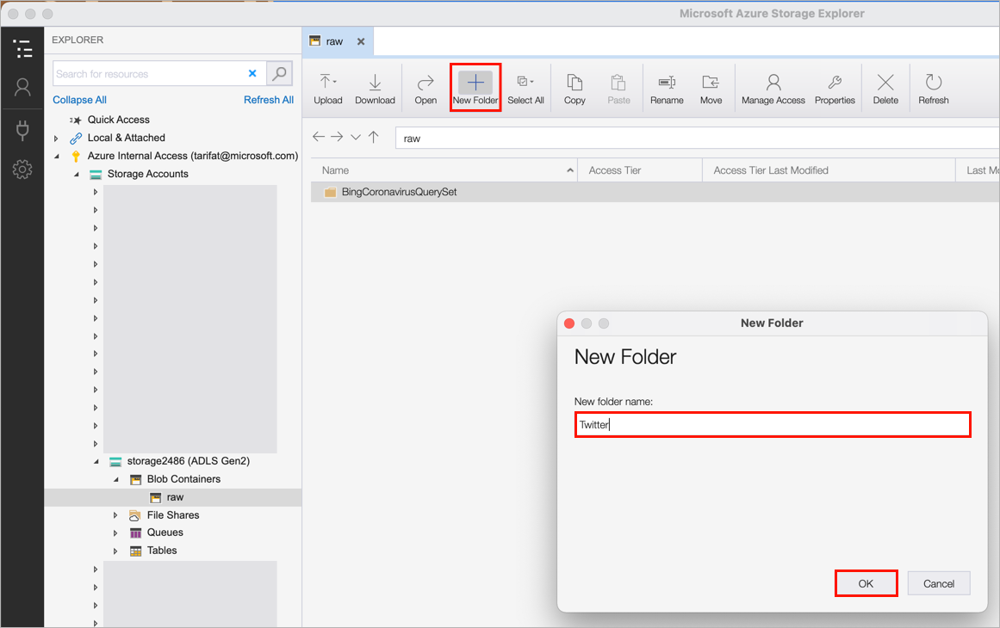

4. Right-click on the newly created folder and click **Open**.

   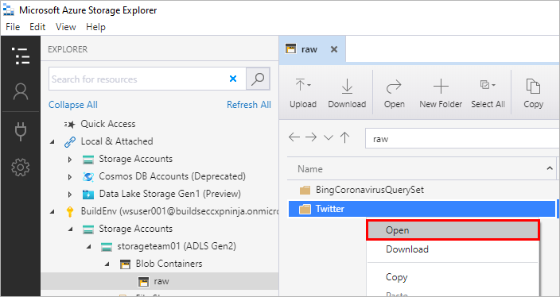

5. Click on the **Upload** button and select **Upload Files...**.

    

6. Select the local copy of **twitter_handles.parquet** and click **Upload**.

    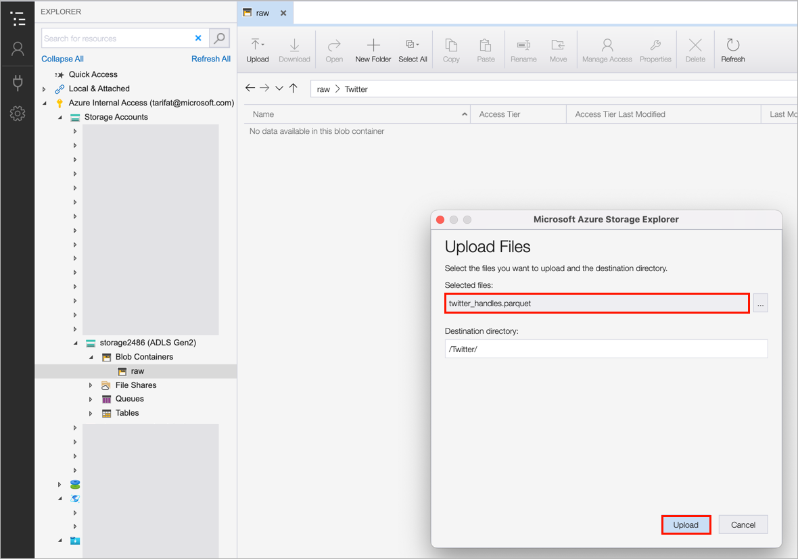

<div align="right"><a href="#module-05---classifications">↥ back to top</a></div>

## 5. Scan an Azure Data Lake Storage Gen2 Account

1. Open the **Microsoft Purview Governance Portal**, navigate to **Data map** > **Sources** and click **New Scan** within the Azure Data Lake Storage Gen2 tile. Note: If you have not registered your Azure Data Lake Storage Gen2 Account, see [module 02](../modules/module02.md).

    

2. Click **Test connection** to ensure the credentials have access and click **Continue**.

    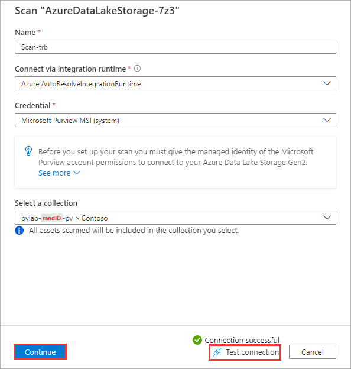

3. By default, Microsoft Purview will have the parent Azure Data Lake Storage Gen2 account selected and therefore include all paths in scope. To reduce the scope, deselect the parent and select the **Twitter** folder only. Click **Continue**.

    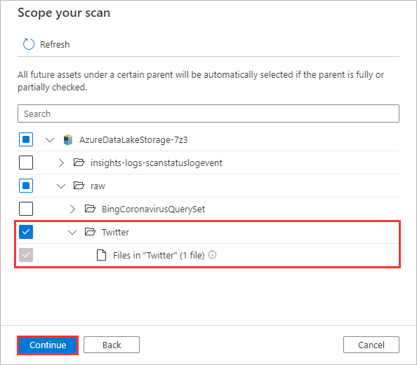

4. To validate the scope of the custom scan rule set, click **View detail**.

    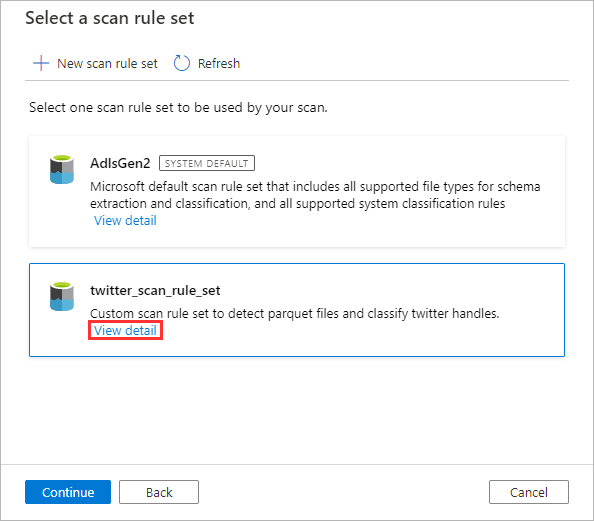

5. Confirm that the custom scan rule set includes the **PARQUET** file type and the custom classification rule **twitter_handle**. Click **OK**.

    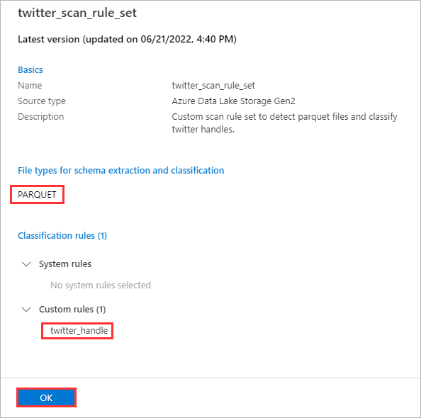

6. Select the custom scan rule set **twitter_scan_rule_set** and click **Continue**.

    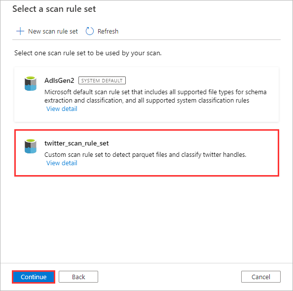

7. Set the scan trigger to **Once** and click **Continue**.

    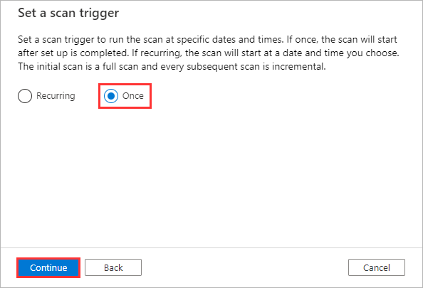

8. Click **Save and Run**.

    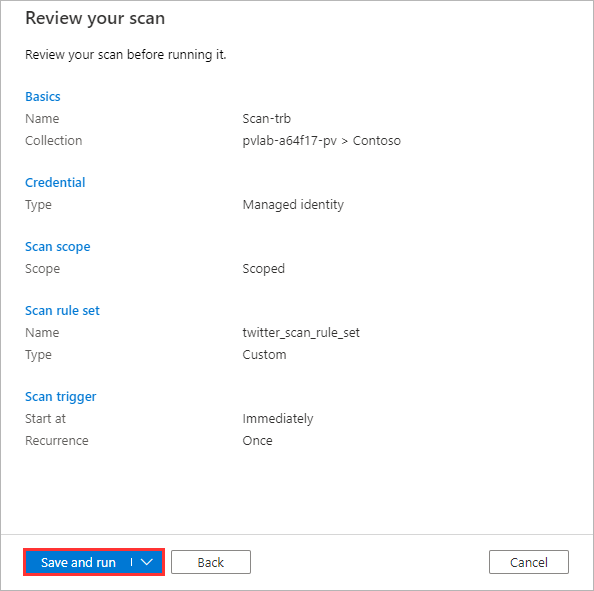

9. To view the progress of the scan, navigate to **Sources** and click **View details** on the Azure Data Lake Storage Gen2 tile.

    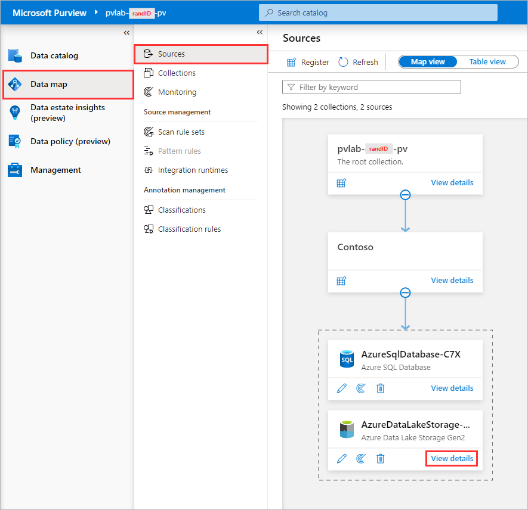

10. Periodically click **Refresh** to update the scan status until **Complete**. Note: This will take approximately 5 to 10 minutes.

    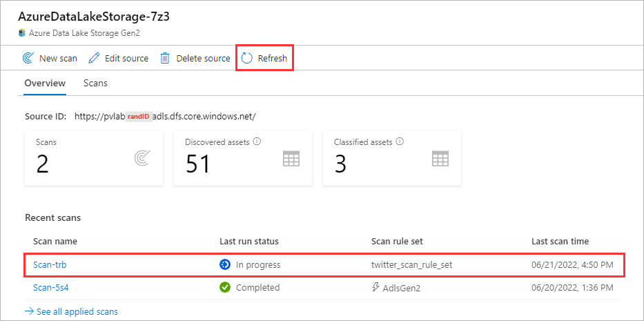

<div align="right"><a href="#module-05---classifications">↥ back to top</a></div>

## 6. Search by Classification

1. Once the scan has complete, perform a wildcard search by typing in the asterisk character (**\***) into the search bar and hit Enter.

    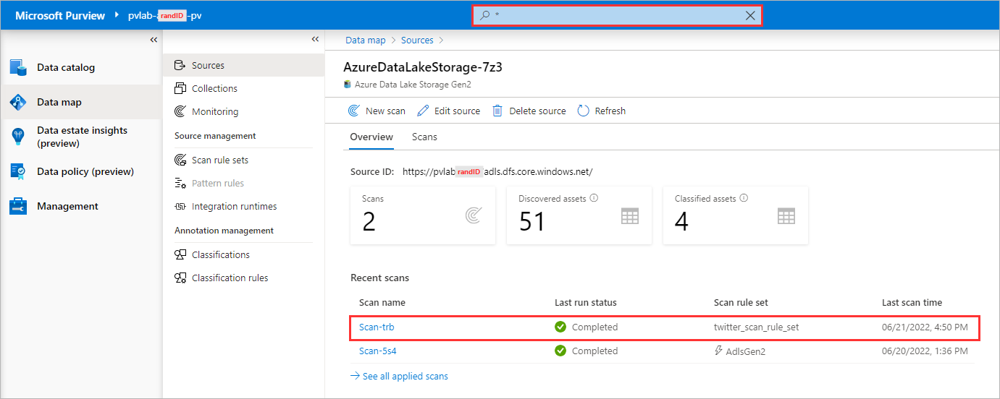

2. Limit the search results by setting **Classification** within the filter panel to **Twitter Handle**. Click on the asset title (**twitter_handles.parquet**) to view the asset details.

    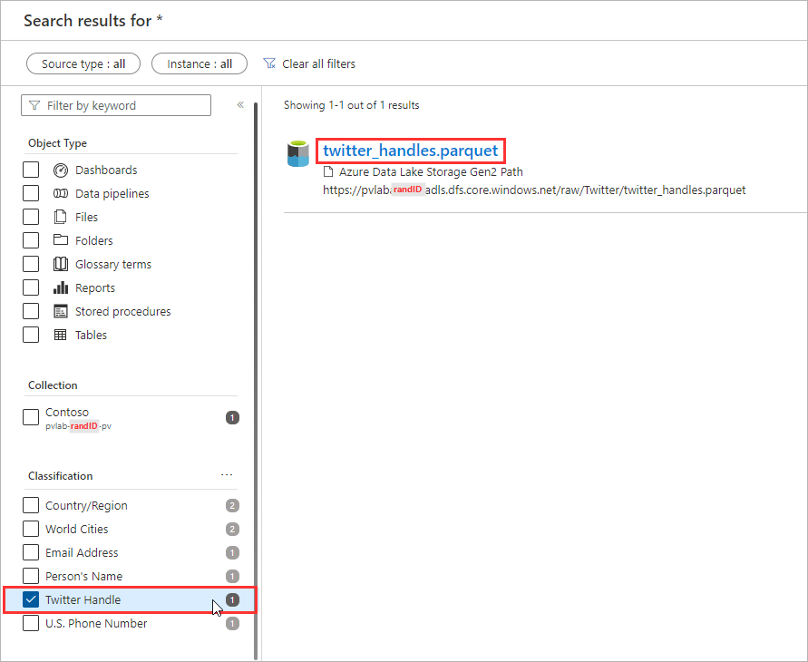

3. You will notice on the Overview tab that the schema includes the Twitter Handle classification. To identity which column has been classified, navigate to the **Schema** tab.

    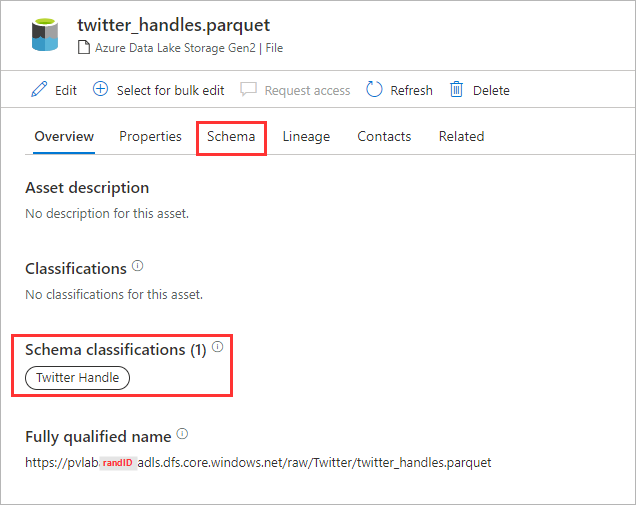

4. Within the Schema tab we can see that **Account name** is the column that has been classified.

    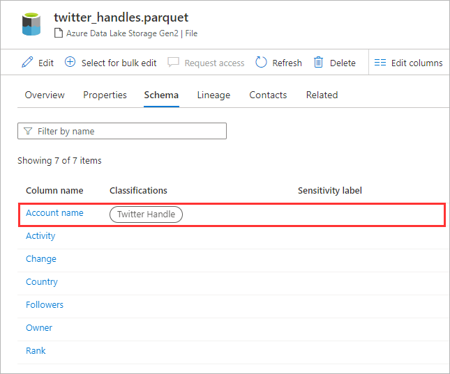

<div align="right"><a href="#module-05---classifications">↥ back to top</a></div>

## :mortar_board: Knowledge Check

[http://aka.ms/purviewlab/q05](http://aka.ms/purviewlab/q05)

1. Which of the following is a valid classification rule type?

    A ) Python  
    B ) Regular Expression  
    C ) C++

2. When creating a regular expression based classification rule, you must specify a Data Pattern **AND** a Column Pattern.

    A ) True  
    B ) False

3. Custom classifications are automatically in scope of a system default scan rule set.

    A ) True  
    B ) False  

<div align="right"><a href="#module-05---classifications">↥ back to top</a></div>

## :tada: Summary

This module provided an overview of how to create a custom classification, and how to have the classification automatically applied as part of a scan using a custom scan rule set.

[Continue >](../modules/module06.md)
