# Module 06 - Lineage

[< Previous Module](../modules/module05.md) - **[Home](../README.md)** - [Next Module>](../modules/module07.md)

## :thinking: Prerequisites

* An [Azure account](https://azure.microsoft.com/en-us/free/) with an active subscription.
* An Azure Azure Purview account (see [module 01](../modules/module01.md)).
* An Azure Data Lake Storage Gen2 Account (see [module 02](../modules/module02.md)).

## :loudspeaker: Introduction

One of the platform features of Azure Purview is the ability to show the lineage between datasets created by data processes. Systems like Data Factory, Data Share, and Power BI capture the lineage of data as it moves. Custom lineage reporting is also supported via Atlas hooks and REST API.

Lineage in Purview includes datasets and processes.

* **Dataset**: A dataset (structured or unstructured) provided as an input to a process. For example, a SQL Table, Azure blob, and files (such as .csv and .xml), are all considered datasets. In the lineage section of Purview, datasets are represented by **rectangular boxes**.

* **Process**: An activity or transformation performed on a dataset is called a process. For example, ADF Copy activity, Data Share snapshot and so on. In the lineage section of Purview, processes are represented by **round-edged boxes**.

This module steps through what is required for connecting an Azure Data Factory account with an Azure Purview account to track data lineage.

## :dart: Objectives

* Connect an Azure Data Factory account with an Azure Purview account.
* Trigger a Data Factory pipeline to run so that the lineage metadata can be pushed into Purview.

## Table of Contents

1. [Create an Azure Data Factory Account](#1-create-an-azure-data-factory-account)
2. [Create an Azure Data Factory Connection in Azure Purview](#2-create-an-azure-data-factory-connection-in-azure-purview)
3. [Copy Data using Azure Data Factory](#3-copy-data-using-azure-data-factory)
4. [View Lineage in Azure Purview](#4-view-lineage-in-azure-purview)

<a href="#module-06---lineage">↥ back to top</a>

## 1. Create an Azure Data Factory Account

1. Sign in to the [Azure portal](https://portal.azure.com) with your Azure account and from the **Home** screen, click **Create a resource**.

      

2. Search the Marketplace for "Data Factory" and click **Create**.
    
    

3. Provide the necessary inputs on the **Basics** tab and then navigate to **Git configuration**.  

    > Note: The table below provides example values for illustrative purposes only, ensure to specify values that make sense for your deployment.

    | Parameter  | Example Value |
    | --- | --- |
    | Subscription | `BuildEnv` |
    | Resource group | `resourcegroup-1` |
    | Region | `East US 2` |
    | Name | `adf-team01` |

    

4. Select **Configure Git later** and click **Review + create**.

    

5. Once validation has passed, click **Create**.

    

6. Wait until the deployment is complete, then return to Purview Studio.

    

<a href="#module-06---lineage">↥ back to top</a>

## 2. Create an Azure Data Factory Connection in Azure Purview

1. Open Purview Studio, navigate to **Management Center** > **Data Factory** and click **New**.

    > :warning: If you are unable to add Data Factory connections, you may need to assign one of the following roles: 
    > * Owner
    > * User Access Administrator

    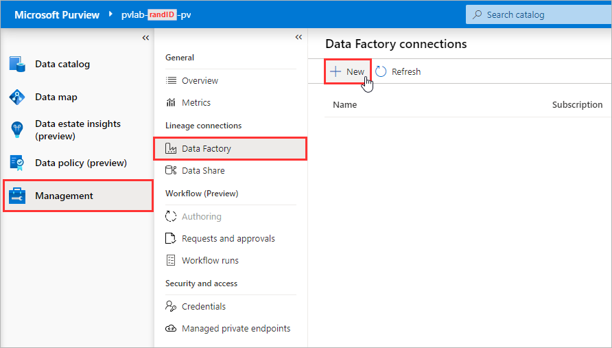

2. Select your Azure Data Factory from the drop-down menu and click **OK**.

    > :bulb: **Did you know?**
    >
    > Azure Purview can connect to **multiple** Azure Data Factories but each Azure Data Factory account can only connect to **one** Azure Purview account.

    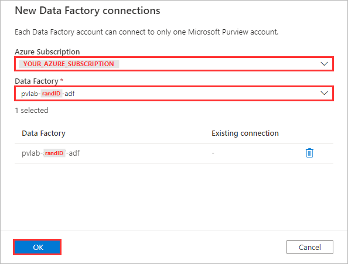

3. Once finished, you should see the Data Factory in a **connected** state.

    

    > :bulb: **Did you know?**
    >
    > When a user registers an Azure Data Factory, behind the scenes the Data Factory managed identity is added to the Purview RBAC role: `Purview Data Curator`. From this point, pipeline executions from that instance of data factory will push lineage metadata back into Purview. See [supported Azure Data Factory activities](https://docs.microsoft.com/en-us/azure/purview/how-to-link-azure-data-factory#supported-azure-data-factory-activities).

<a href="#module-06---lineage">↥ back to top</a>

## 3. Copy Data using Azure Data Factory

1. Within the Azure Portal, navigate to your Azure Data Factory resource and click **Author & Monitor**.

    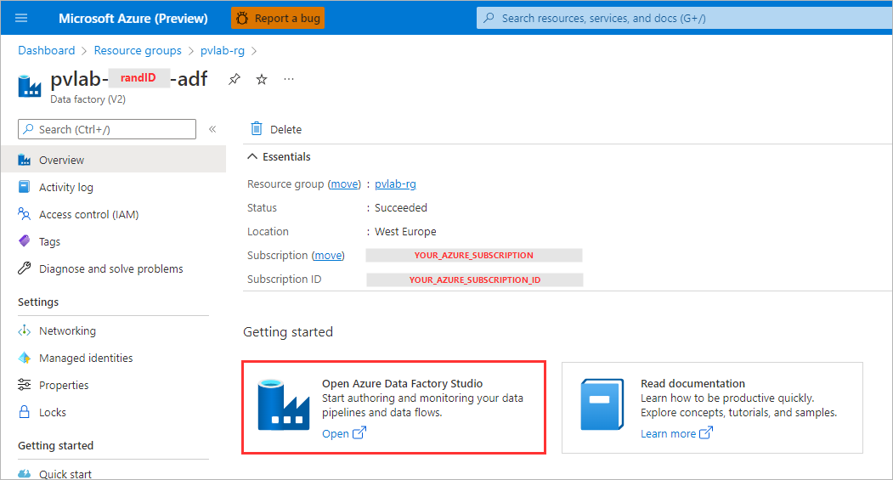

2. Click **Copy data**.
    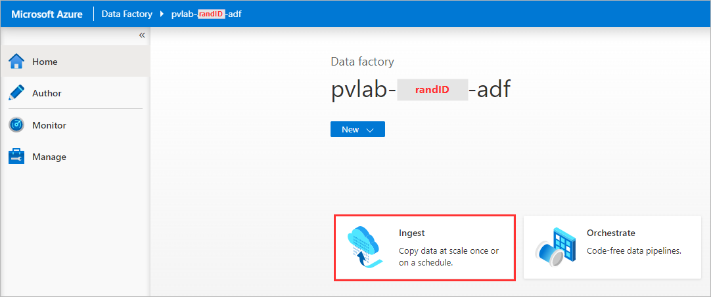

3. Rename the task to **copyPipeline** and click **Next**.

    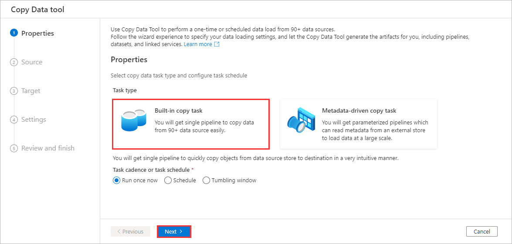

4. Click **Create new connection**.
    
    

5. Filter the list of sources by clicking **Azure**, select **Azure Data Lake Storage Gen2** and click **Continue**.
    
    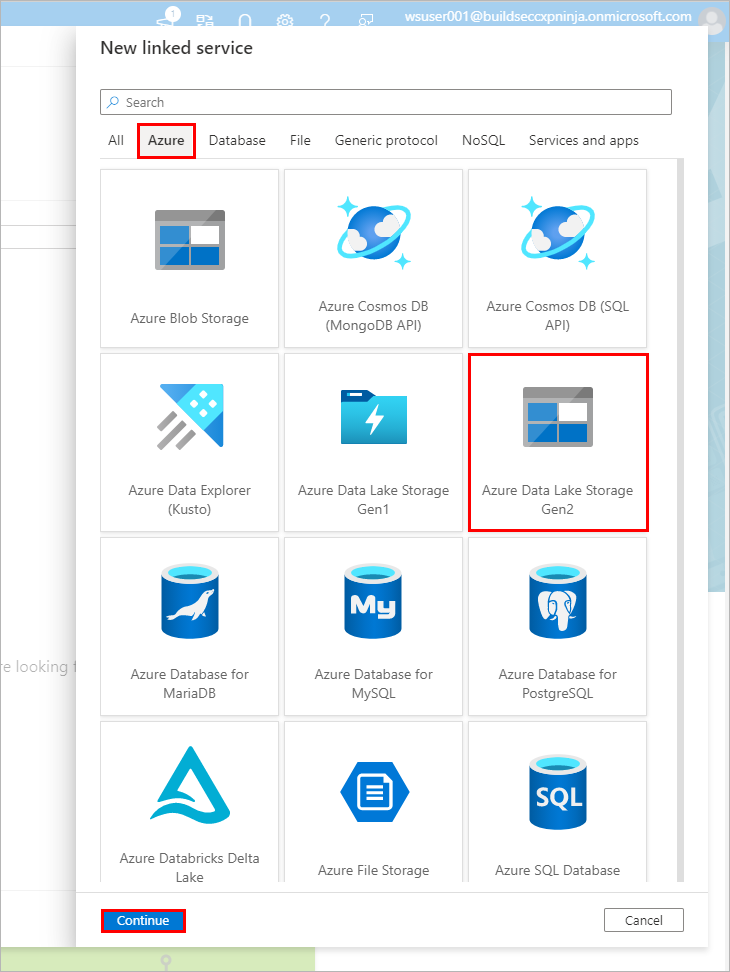

6. Select your **Azure subscription** and **Storage account**, click **Test connection** and then click **Create**.

    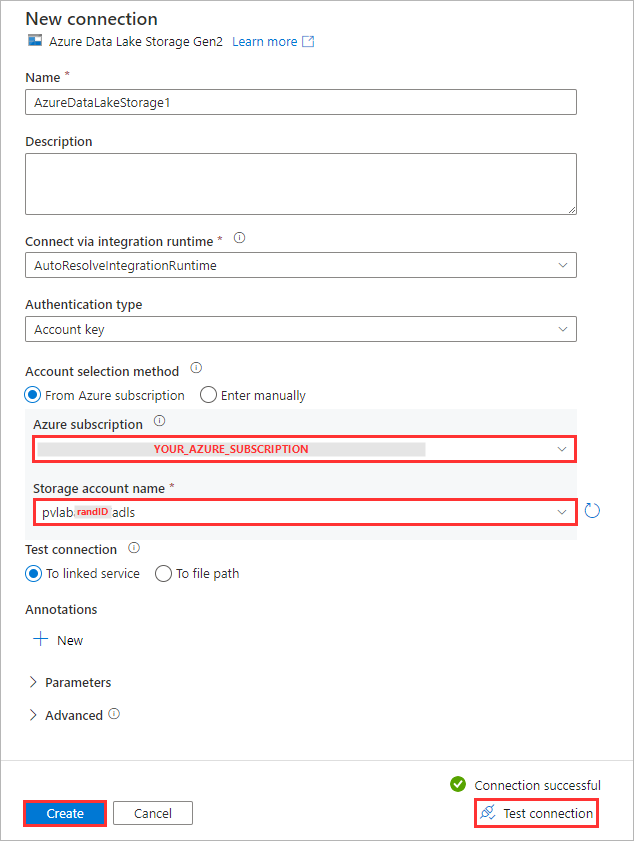

7. Click **Next**.

    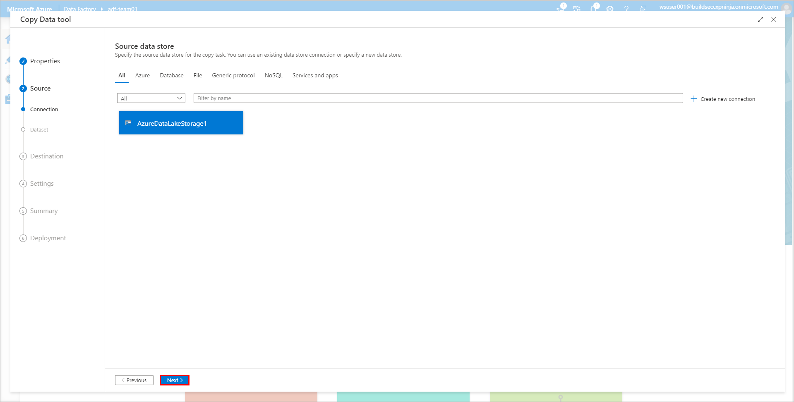

8. Click **Browse**.

    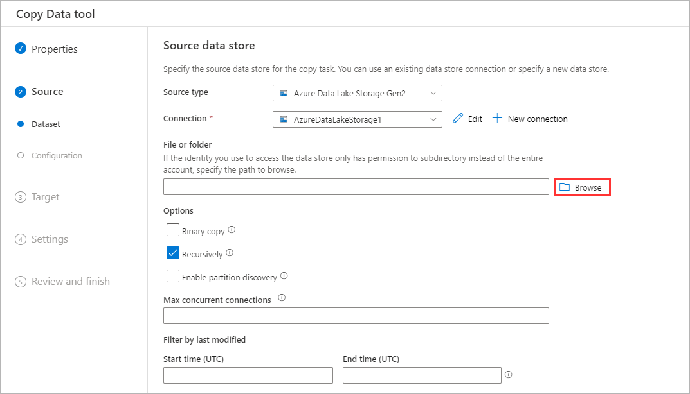

9. Navigate to `raw/BingCoronavirusQuerySet/2020/` and click **Choose**.
    
    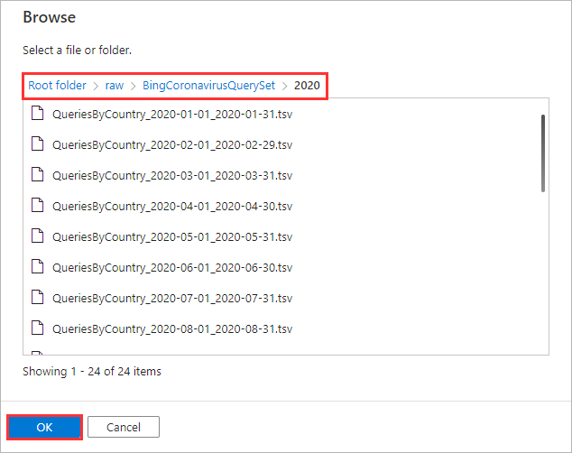

10. Confirm your folder path selection and click **Next**.

    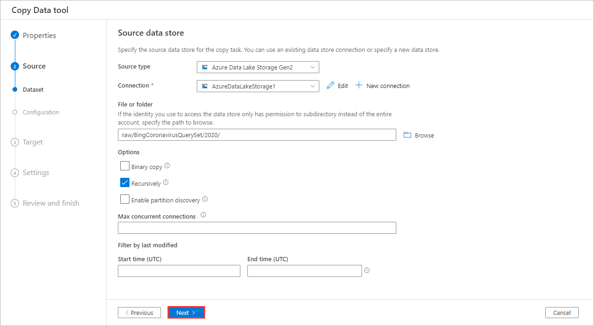

11. Preview the sample data and click **Next**.
    
    

12. Select the same **AzureDataLakeStorage1** connection for the destination and click **Next**.

    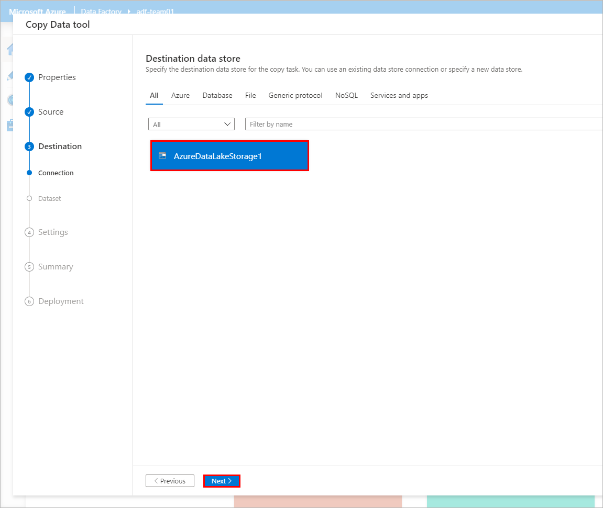

13. Click **Browse**.

    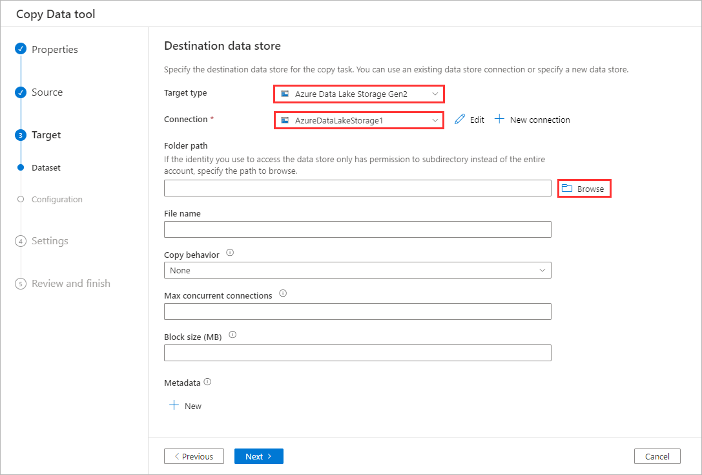

14. Navigate to `raw/` and click **Choose**.

    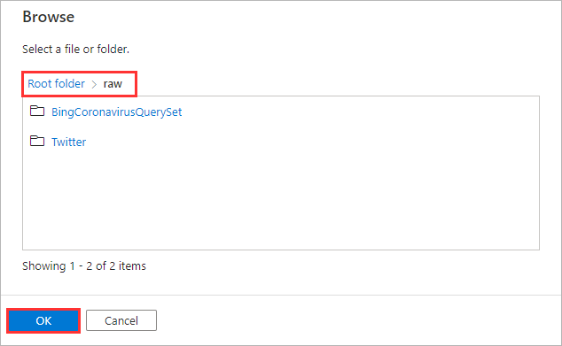

15. Confirm your folder path selection, set the **file name** to `2020_merged.parquet`, set the **copy behavior** to **Merge files**, and click **Next**.

    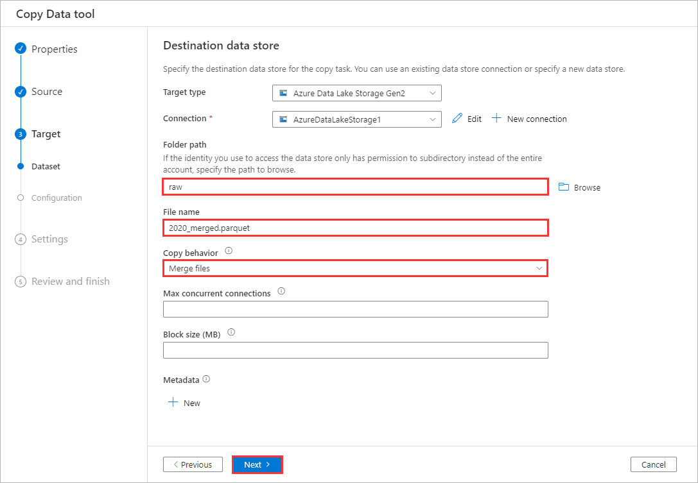

16. Set the **file format** to **Parquet format** and click **Next**.

    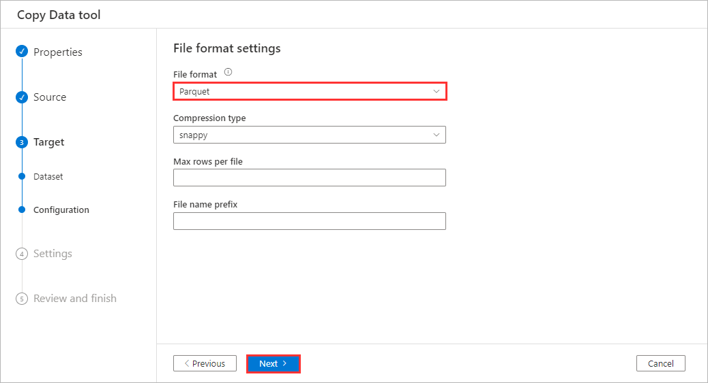

17. Leave the default settings and click **Next**.

    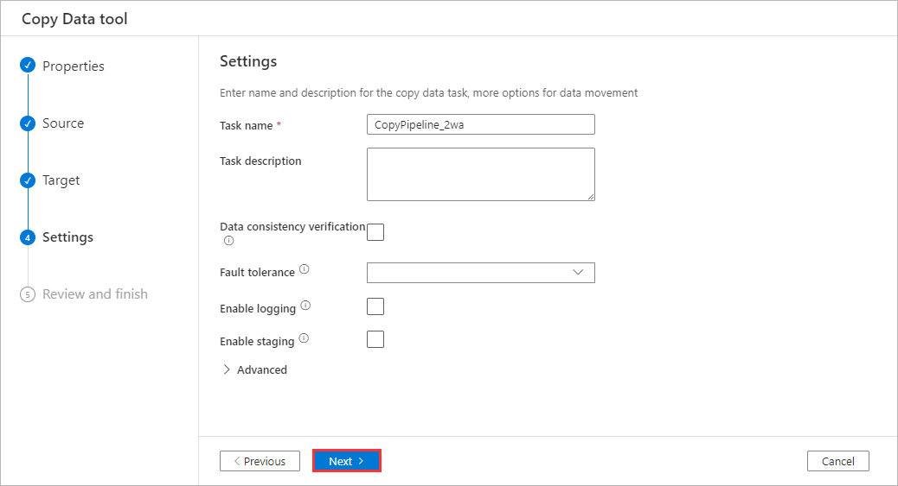

18. Review the summary and proceed by clicking **Next**.

    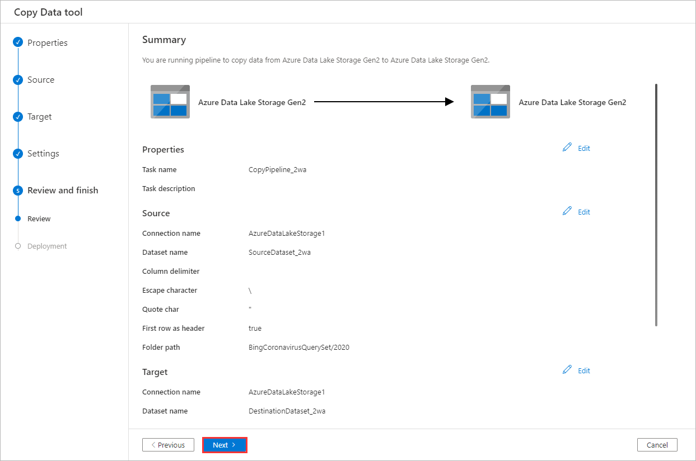

19. Once the deployment is complete, click **Finish**.

    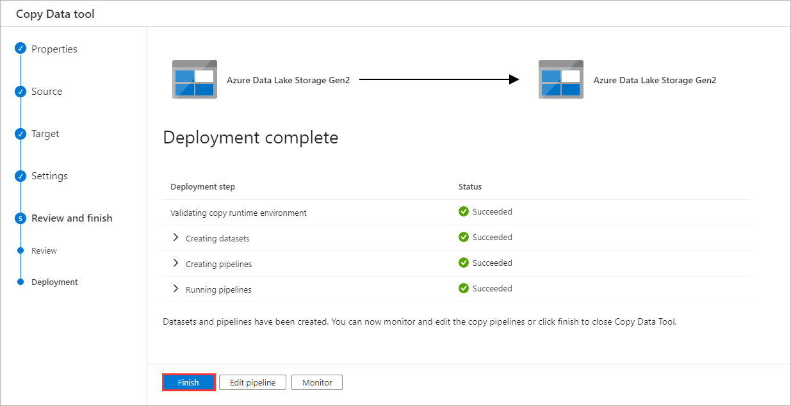

20. Navigate to the **Monitoring** screen to confirm the pipeline has run **successfully**.

    

<a href="#module-06---lineage">↥ back to top</a>

## 4. View Lineage in Azure Purview

1. Open Purview Studio, from the Home screen click **Browse assets**.

    

2. Select **Azure Data Factory**.

    

3. Select the **Azure Data Factory account instance**.

    

4. Select the **copyPipeline** and click to open the **Copy Activity**.
    
    

5. Navigate to the **Lineage** tab.

    

6. You can see the lineage information has been automatically pushed from Azure Data Factory to Purview. On the left are the two sets of files that share a common schema in the source folder, the copy activity sits in the center, and the output file sits on the right.

    

<a href="#module-06---lineage">↥ back to top</a>

## :tada: Summary

This module provided an overview of how to integrate Azure Purview with Azure Data Factory and how relationships between assets and ETL activities can be automatically created at run time, allowing us to visually represent data lineage and trace upstream and downstream dependencies.
