# Module 08 - Monitor

[< Previous Module](../modules/module07.md) - **[Home](../README.md)** - [Next Module >](../modules/module09.md)

## :thinking: Prerequisites

* An [Azure account](https://azure.microsoft.com/en-us/free/) with an active subscription.
* An Azure Azure Purview account (see [module 01](../modules/module01.md)).

## :loudspeaker: Introduction

Azure Purview administrators can use Azure Monitor to track the operational state of an Azure Purview account instance. Metrics are collected to provide data points for you to track potential problems, troubleshoot, and improve the reliability of the Purview platform.

## :dart: Objectives

* View Azure Purview metrics.
* Send Azure Purview diagnostic logs to Azure Storage.

## Table of Contents

1. [Provide a User Access to Azure Purview Metrics](#1-provide-a-user-access-to-azure-purview-metrics)
2. [Visualize Azure Purview Metrics](#2-visualize-azure-purview-metrics)
3. [Send Diagnostic Logs to Azure Storage](#3-send-diagnostic-logs-to-azure-storage)

<a href="#module-08---monitor">↥ back to top</a>

## 1. Provide a User Access to Azure Purview Metrics

Metrics can be accessed from the Azure Portal for an Azure Purview account instance. Access to the metrics can be granted via a role assignment.
* The person who created the Purview account automatically gets permissions to view metrics.
* Other individuals can be provided access by adding them to the **Monitoring Reader** role.

1. Sign in to the [Azure portal](https://portal.azure.com) and navigate to your **Azure Purview** > **Access Control** > **Role assignments**.

    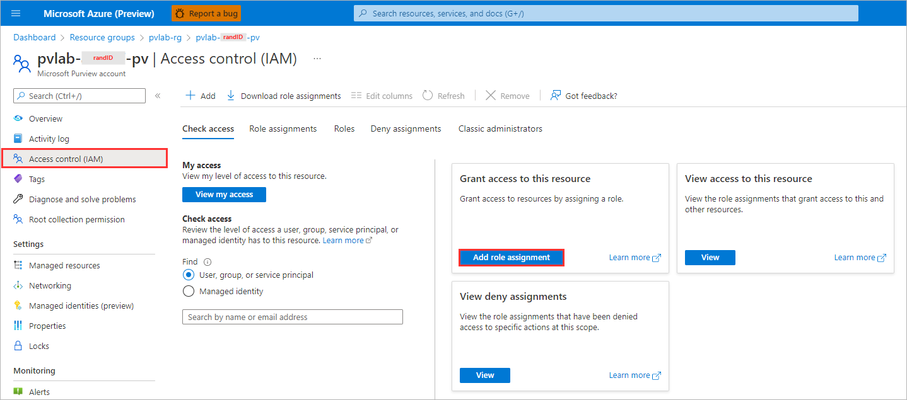

2. Click **Add** and then select **Add role assignment**.

    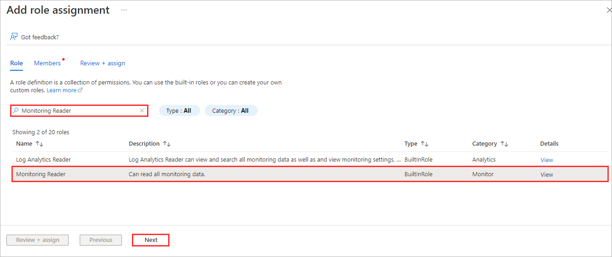

3. Populate the role assignment prompt as per the table below, select the member from the list, click **Save**.

    | Property  | Value |
    | --- | --- |
    | Role | `Monitoring Reader` |
    | Assign access to | `User, group, or service principal` |
    | Select | `<account-name>` |

    > :bulb: **Did you know?**
    >
    > **Monitoring Reader** role can view all monitoring data but cannot modify any resource or edit any settings related to monitoring resources. This role is appropriate for users in an organization such as Azure Purview administrators.

    

4. Navigate to the **Role assignments** tab and confirm the identity has been assigned the **Monitoring Reader** role. Tip: Filter **Scope** to `This resource` to limit the results.

    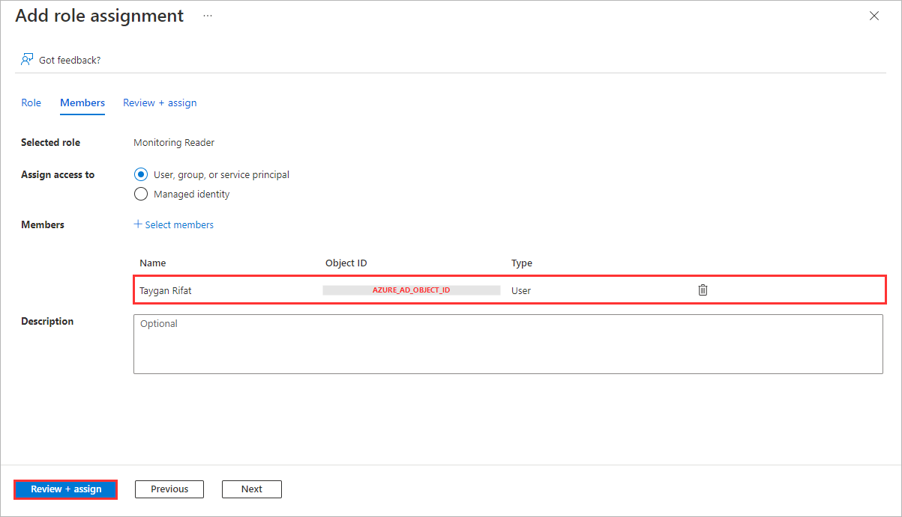

<a href="#module-08---monitor">↥ back to top</a>

## 2. Visualize Azure Purview Metrics

1. Navigate to your **Azure Purview** account instance and click **Metrics**.

    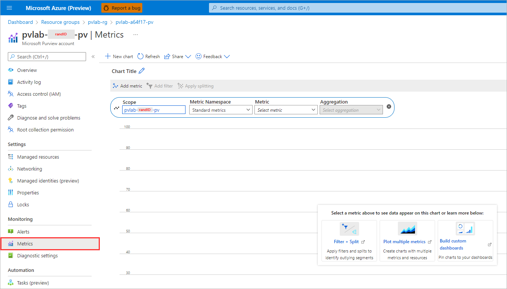

2. Click to open the **Metric** drop-down menu and select one of the metrics (e.g. `Scan time taken`).

    **Available Metrics**
    | Metric ID  | Metric Name | Metric Description |
    | --- | --- | --- |
    | ScanCancelled | `Scan Cancelled` | Indicates the number of scans cancelled. |
    | ScanCompleted | `Scan Completed` | Indicates the number of scans completed successfully. |
    | ScanFailed | `Scan Failed` | Indicates the number of scans failed. |
    | ScanTimeTaken | `Scan Time Taken` | Indicates the total scan time in seconds. |

    

3. Click on the chart type to change the graph to a **Bar chart**.

    

4. Click on the **time range** to change the duration to **Last 30 Days** and click **Apply**.

    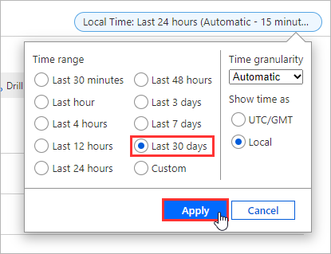

5. Below is an example. Note: The account instance would need some historical scan activity in order to visualize the metric. 

    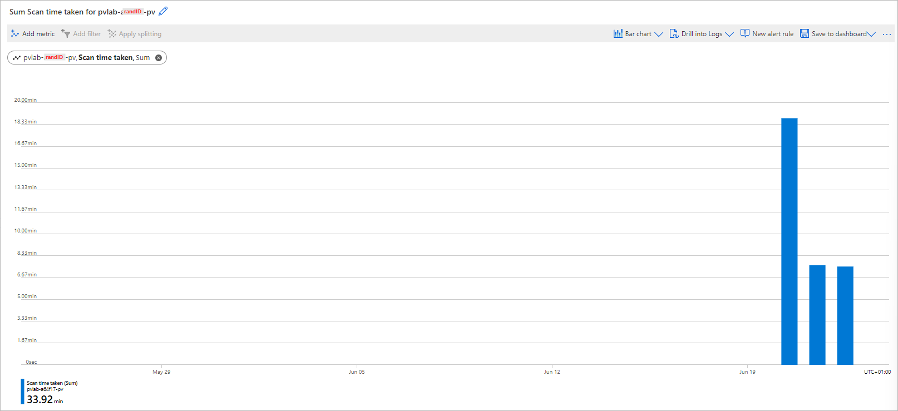

<a href="#module-08---monitor">↥ back to top</a>

## 3. Send Diagnostic Logs to Azure Storage

1. Navigate to the Azure Portal, and **create** a **Storage account**.

    

2. Provide the necessary inputs on the **Basics** tab and click **Review + create**.

    > Note: The table below provides example values for illustrative purposes only, ensure to specify values that make sense for your deployment.

    | Parameter  | Example Value |
    | --- | --- |
    | Subscription | `Azure Internal Access` |
    | Resource group | `purview-workshop` |
    | Storage account name | `blob2486` |
    | Location | `(South America) Brazil South` |
    | Performance | `Standard` |
    | Account kind | `StorageV2 (general purpose v2)` |
    | Replication | `Locally-redundant storage (LRS)` |

    

3. Click **Create**.

    

4. Monitor your deployment until the status changes to **Your deployment is complete**.

    

5. Navigate to your **Azure Purview** account instance, click **Diagnostic settings** and select **Add diagnostic setting**.

    > :bulb: **Did you know?**
    >
    > **Diagnostic settings** can be used to send platform logs and metrics to one or more destinations (Log Analytics Workspace, Storage Account, an Event Hub).

    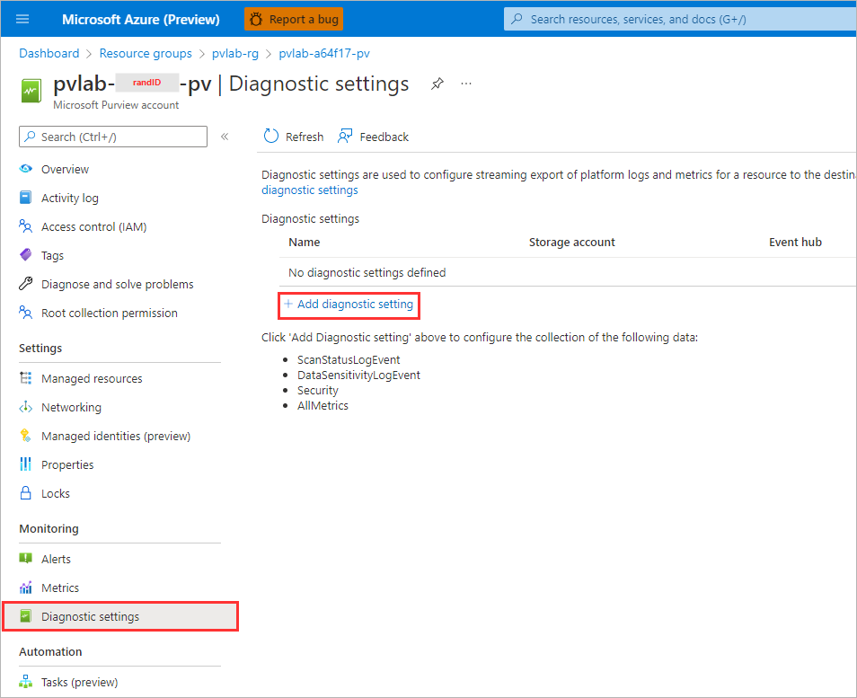

6. Provide the diagnostic setting a name (e.g. `Audit`), select **ScanStatusLogEvent**, select **Archive to a storage account**, select your storage account (e.g. `blob2486`) and click **Save**.

    > :bulb: **Did you know?**
    >
    > **ScanStatusLogEvent** tracks the scan life cycle. A scan operation follows progress through a sequence of states, from Queued, Running and finally a terminal state of Succeeded | Failed | Canceled. An event is logged for each state transition.

    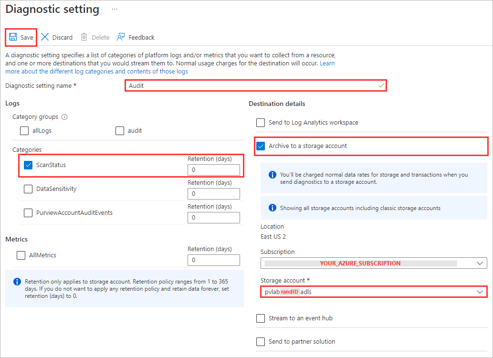

7. To test the capture of raw events, trigger a full scan by navigating to **Azure Purview Studio** > **Sources** and click **View details** on an existing source.

    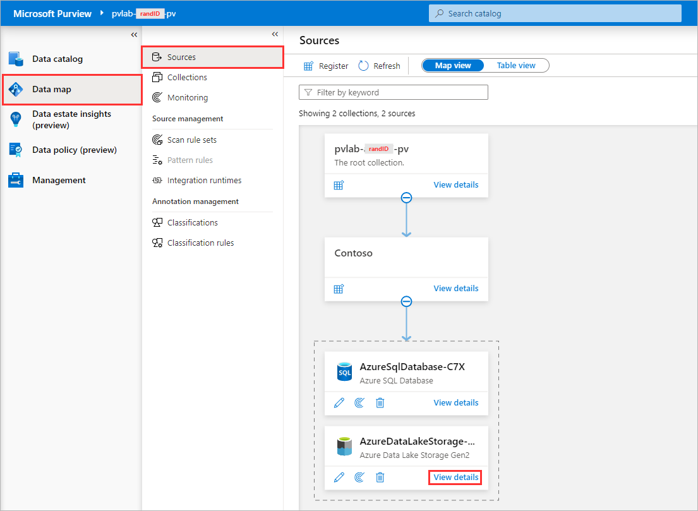

8. Navigate to the **Scans** tab and click the name of a previously run scan.

    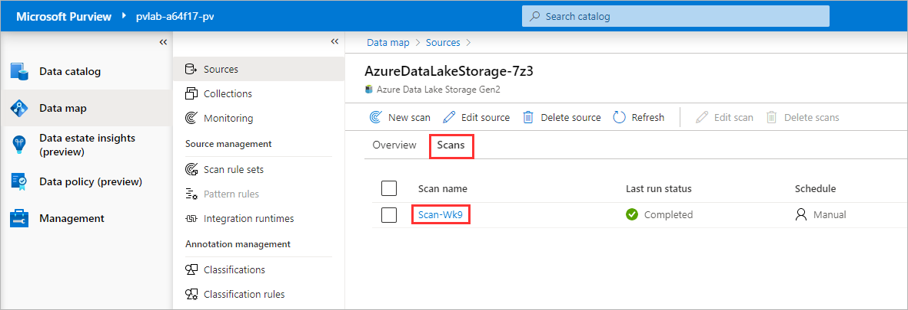

9. Open the **Run scan now** drop-down menu and select **Full Scan**.

    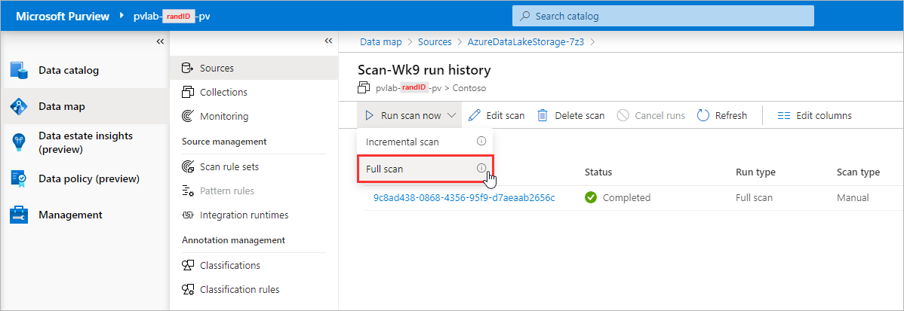

10. Monitor the scan status by periodically click the **Refresh** button.

    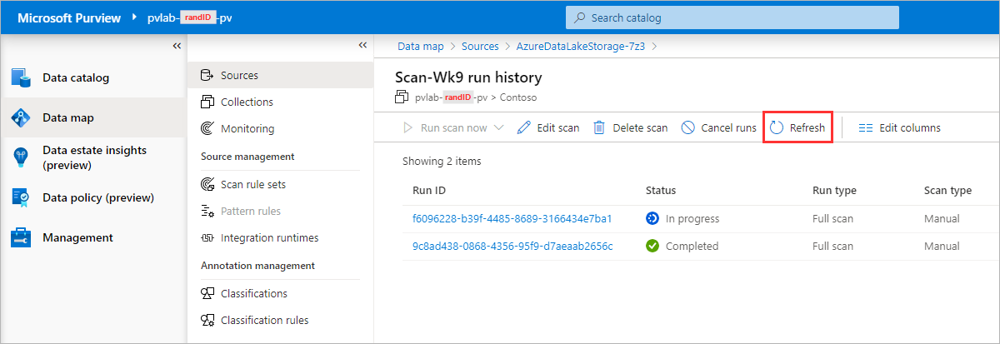

11. Once the scan is complete, open your storage account within the Azure Portal and navigate to **Storage Explorer**. If the audit log has been captured, you should be able to navigate down the folder path until you find a JSON document that contains details about the scan. Note: You can also use [Storage Explorer](https://azure.microsoft.com/en-us/features/storage-explorer/) as an alternative to the Azure Portal.

    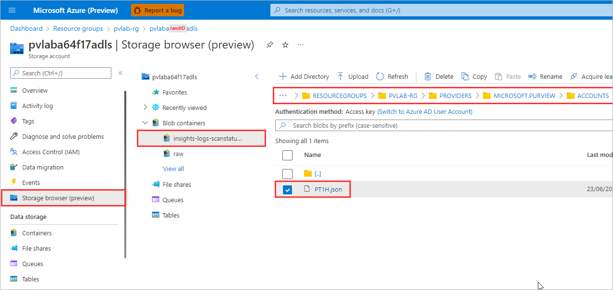

12. Download and open a local copy of the JSON file to see the details (e.g. dataSourceName, dataSourceType, assetsDiscovered, scanTotalRunTimeInSeconds, etc).

    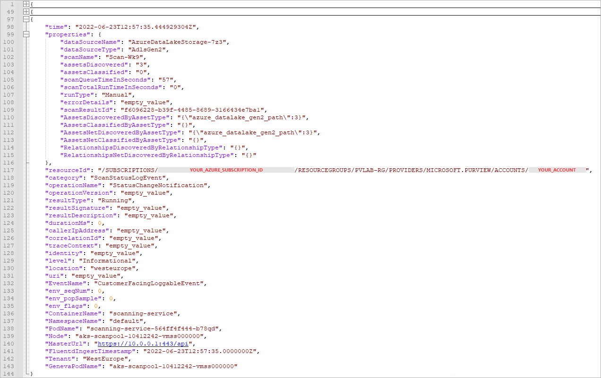

<a href="#module-08---monitor">↥ back to top</a>

## :mortar_board: Knowledge Check

[http://aka.ms/purviewlab/q08](http://aka.ms/purviewlab/q08)

1. Which built-in role is needed to provide users access to **view monitoring data**?

    A ) Purview Data Reader  
    B ) Metrics Reader  
    C ) Monitoring Reader

2. Which of the following is **not** available as an Azure Purview metric?

    A ) ScanCompleted  
    B ) ScanDuration  
    C ) ScanTimeTaken

3. The **ScanStatusLogEvent** schema contains an attribute that indicates the total run time. What is the name of this attribute?

    A ) scanTotalRunTime  
    B ) scanTotalRunTimeInSeconds  
    C ) scanTotalDuration

<a href="#module-08---monitor">↥ back to top</a>

## :tada: Summary

This module provided an overview of how to visualize Azure Purview metrics within the Azure Portal and how to capture raw telemetry to an Azure Storage account.

[Continue >](../modules/module09.md)
