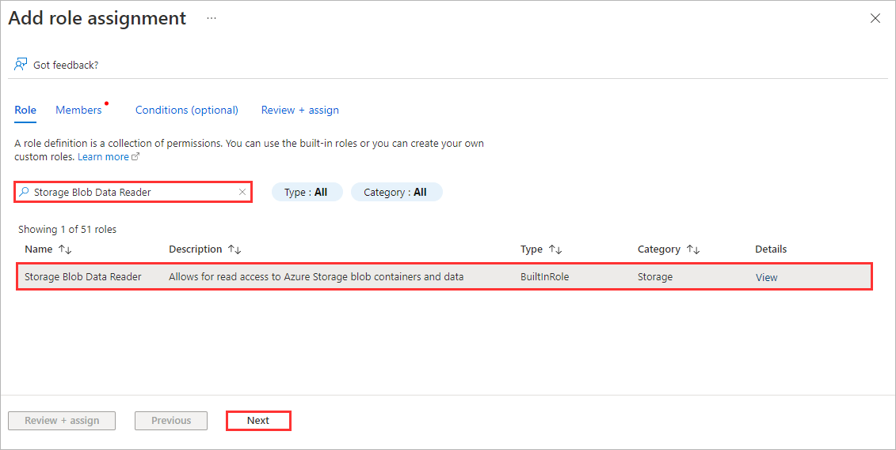
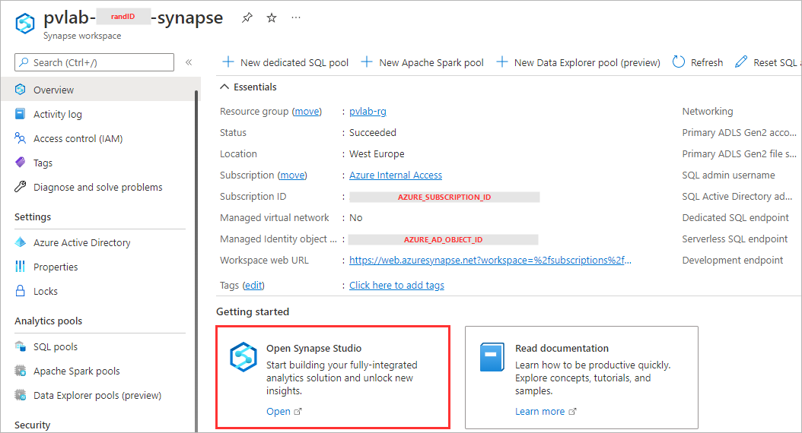
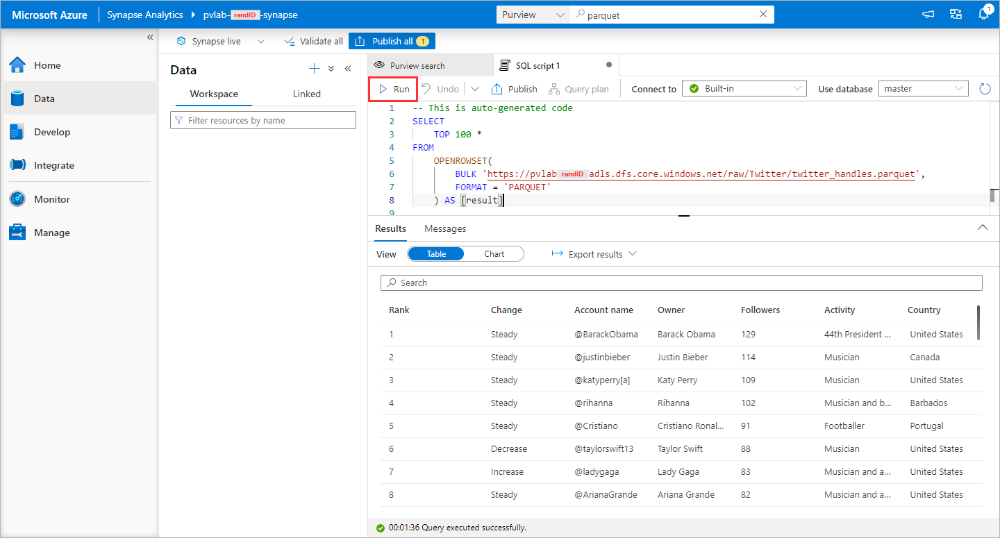

# Module 09 - Integrate with Azure Synapse Analytics

[< Previous Module](../modules/module08.md) - **[Home](../README.md)** - [Next Module >](../modules/module10.md)

## :thinking: Prerequisites

* An [Azure account](https://azure.microsoft.com/en-us/free/) with an active subscription.
* An Azure Azure Purview account (see [module 01](../modules/module01.md)).
* An Azure Purview catalog with some assets (see [module 02](../modules/module02.md)).

## :loudspeaker: Introduction

Registering an Azure Purview account to a Synapse workspace allows you to discover Azure Purview assets, interact with them through Synapse specific capabilities, and push lineage information to Azure Purview.

## :dart: Objectives

* Register an Azure Purview account to a Synapse workspace.
* Query a dataset that exists in the Azure Purview catalog with Azure Synapse Analytics.

## Table of Contents

1. [Azure Data Lake Storage Gen2 Account Access](#1-azure-data-lake-storage-gen2-account-access)
2. [Connect to a Purview Account](#3-connect-to-a-purview-account)
3. [Search a Purview Account](#4-search-a-purview-account)

<a href="#module-09---integrate-with-azure-synapse-analytics">↥ back to top</a>

## 1. Azure Data Lake Storage Gen2 Account Access

> :bulb: **Did you know?**
>
> One of the key benefits of integrating Azure Purview with Azure Synapse Analytics, is the ability to discover Azure Purview assets from within Synapse Studio (i.e. no need to swtich between experiences) with the added ability to interact using Synapse specific capabilities (e.g. SELECT TOP 100). 
>
> Note: Before we can demonstrate the ability to query external data sources from Azure Synapse Analytics, we need to ensure our account has the appropriate level of access (i.e. `Storage Blob Data Reader`).

1. Navigate to the **Access Control (IAM)** screen within the Azure Data Lake Storage Gen2 account provisioned in [module 02](../modules/module02.md) and click **Add role assignments**.

    

2. Select the **Storage Blob Data Reader** role and assign this to the account that will query the external data source via Synapse Workspace (i.e. your account). Click **Save**.

    | Property  | Value |
    | --- | --- |
    | Role | `Storage Blob Data Reader` |
    | Assign access to | `User, group, or service principal` |
    | Select | `<account-name>` |

    

<a href="#module-09---integrate-with-azure-synapse-analytics">↥ back to top</a>

## 2. Connect to a Purview Account

1. Within the Azure portal, open the Synapse workspace and click **Open Synapse Studio**.

    

2. Navigate to **Manage** > **Azure Purview (Preview)** and click **Connect to a Purview account**.

    

3. Select your **Purview account** from the drop-down menu and click **Apply**.

    

4. Once the connection has been established, you will receive a notification that **Registration succeeded**.

    

<a href="#module-09---integrate-with-azure-synapse-analytics">↥ back to top</a>

## 3. Search a Purview Account

1. Within the Synapse workspace, navigate to the **Data** screen and perform a **keyword search** (e.g. `parquet`). Notice that the search bar now defaults to searching the entire Purview catalog as opposed to the Synapse workspace only.

    

2. Click to open the **asset details** of one of the items (e.g. `twitter_handles.parquet`).

    

3. Notice the special Synapse-specific menu items such as **Connect** and **Develop**. For supported file types such as parquet, you can quickly generate sample code to query the external source by navigating to **Develop** > **New SQL script** > **Select top 100**.

    

4. To execute the query, click **Run**. Note: The user executing the query must have the appropriate level of access (e.g. Storage Blob Data Reader), see step 1 for more details..

    

<a href="#module-09---integrate-with-azure-synapse-analytics">↥ back to top</a>

## :mortar_board: Knowledge Check

[http://aka.ms/purviewlab/q09](http://aka.ms/purviewlab/q09)

1. Connecting a Synapse workspace to Azure Purview enables you to discover data assets that live **outside** of the Azure Synapse Analytics workspace?

    A ) True  
    B ) False  

2. A single Synapse Analytics workspace can connect to **multiple** Azure Purview accounts?

    A ) True  
    B ) False  

3. Once Synapse Analytics is connected to an Azure Purview account, users can quickly generate a new linked service or integration dataset via the action buttons (for supported file types)?

    A ) True    
    B ) False  

<a href="#module-09---integrate-with-azure-synapse-analytics">↥ back to top</a>

## :tada: Summary

This module provided an overview of how to register an Azure Purview account to an Azure Synapse Analytics Workspace, view the details of an asset that exists outside of the Synapse workspace, and how you can quickly query an external source.

[Continue >](../modules/module10.md)
