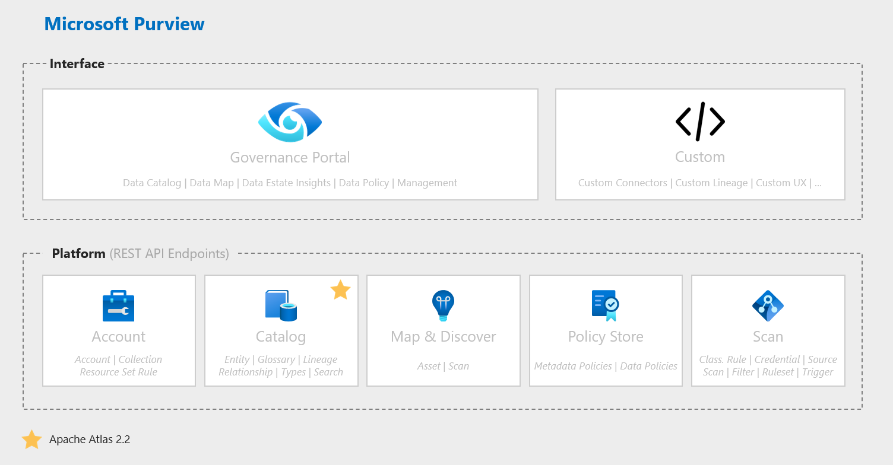
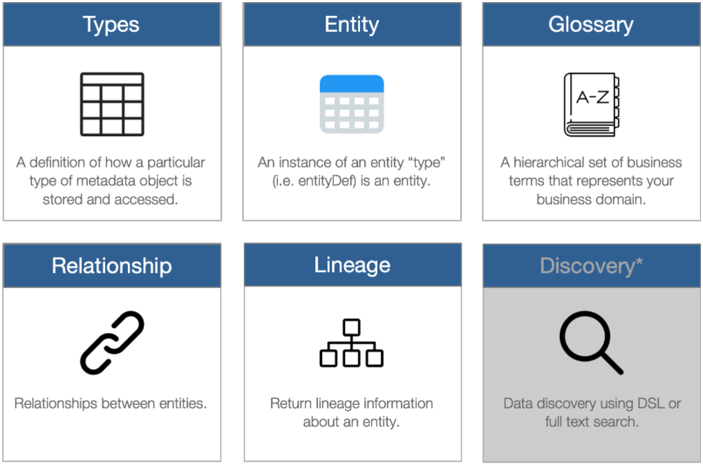
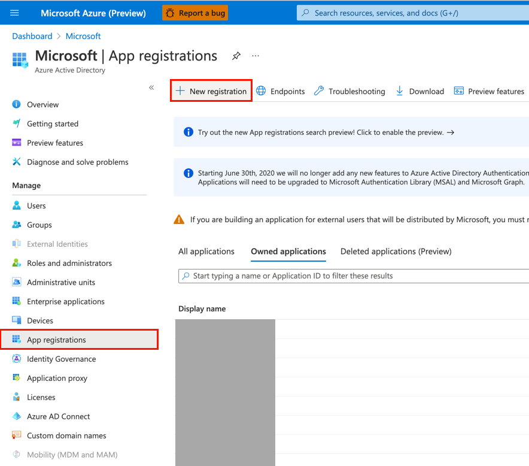
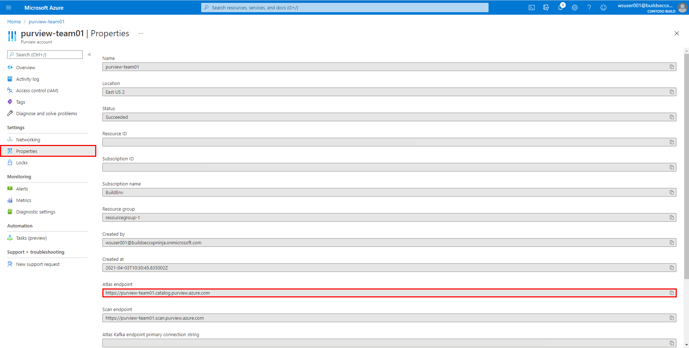
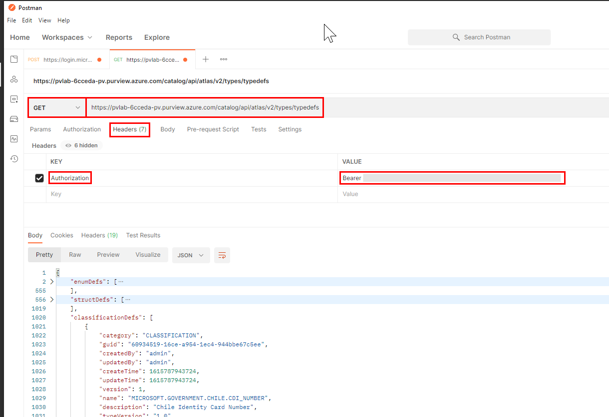
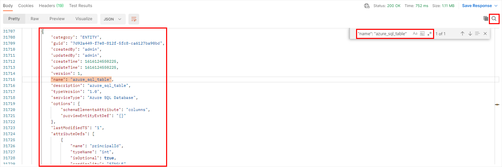

# Module 10 - REST API

[< Previous Module](../modules/module09.md) - **[Home](../README.md)** - [Next Module >](../modules/module11.md)

## :thinking: Prerequisites

* An [Azure account](https://azure.microsoft.com/en-us/free/) with an active subscription.
* An Azure Azure Purview account (see [module 01](../modules/module01.md)).

## :hammer: Tools

* [Postman](https://www.postman.com/product/rest-client/) (Download and Install)

## :loudspeaker: Introduction

While Purview Studio is the default method of interfacing with Azure Purview, the underlying platform can be accessed via a set of API's. This opens up the possibility of a variety of scenarios including (but not limited to):  
  * Working with Azure Purview assets programmatically (e.g. bulk create/read/update/delete).
  * Adding support for other data sources beyond those supported out of the box.
  * Extending the lineage functionality to other ETL processes.
  * Embedding Azure Purview asset data within custom user experiences.
  * Triggering Azure Purview scans to run off the back of a custom event.
  * etc.

Conceptually, Azure Purview has two high-level components:
1. The Interface (e.g. Purview Studio)
2. The Platform (e.g. REST API)

Within the Azure Purview platform, there are API endpoints which are open and accessible, each responsible for different aspects of the Azure Purview service. For example:

| Application | Endpoint |
| --- | --- |
| Catalog | YOUR_PURVIEW_ACCOUNT.purview.azure.com/**catalog** |
| Scan | YOUR_PURVIEW_ACCOUNT.purview.azure.com/**scan** |
| Insight | YOUR_PURVIEW_ACCOUNT.purview.azure.com/**mapanddiscover** |

The primary focus of this module is the **catalog** which is based on the open-source [Apache Atlas](https://atlas.apache.org/) project. Read below for more details on Apache Atlas and how it relates to Azure Purview.




## :dart: Objectives

* Set up an Azure Purview development environment.
* Read data from the Azure Purview platform.
* Write data back to the Azure Purview platform.

## Table of Contents

1. [Apache Atlas](#1-apache-atlas)
2. [Register an Application](#1-register-an-application)
2. [Generate a Client Secret](#2-generate-a-client-secret)
3. [Provide Service Principal Access to Azure Purview](#3-provide-service-principal-access-to-azure-purview)
4. [Use Postman to Call Azure Purview REST API](#4-use-postman-to-call-azure-purview-rest-api)


<div align="right"><a href="#module-10---rest-api">↥ back to top</a></div>

## 1. Apache Atlas

> :world_map: **What is Apache Atlas?**
>
> *"Apache Atlas provides open metadata management and governance capabilities for organizations to build a catalog of their data assets, classify and govern these assets and provide collaboration capabilities around these data assets for data scientists, analysts and the data governance team."* 
>
> Source: [Apache.org](https://atlas.apache.org/#/)

Azure Purview's data catalog is largely based on Apache Atlas, and therefore shares much of the same surface area that allows users to programmatically perform CRUD (CREATE/READ/UPDATE/DELETE) operations over Azure Purview assets. Check out the official.

**Atlas Concepts**

As can be seen in the [Apache Atlas Swagger](https://atlas.apache.org/api/v2/ui/index.html#/), Atlas has a variety of REST endpoints that handle different aspects of the catalog (e.g. types, entities, glossary, etc). 

* **Types**: A definition (or blueprint) as to how a particular type of metadata object can be created. This is similar to the concept of a Class in object-oriented programming. For example: The type definition for an `azure_sql_table` is of category `ENTITY` and contains unique attributes such as `principalId`, `objectType`, etc in addition to inherited attributes such as `name`, `qualifiedName`, etc .

<details>
  <summary>
    Example: Azure SQL Table (Type)
  </summary>
  <div>
```json
{
   "attributeDefs":[
      {
         "cardinality":"SINGLE",
         "includeInNotification":false,
         "isIndexable":false,
         "isOptional":true,
         "isUnique":false,
         "name":"principalId",
         "typeName":"int",
         "valuesMaxCount":1,
         "valuesMinCount":0
      },
      {
         "cardinality":"SINGLE",
         "includeInNotification":false,
         "isIndexable":false,
         "isOptional":true,
         "isUnique":false,
         "name":"objectType",
         "typeName":"string",
         "valuesMaxCount":1,
         "valuesMinCount":0
      },
      {
         "cardinality":"SINGLE",
         "includeInNotification":false,
         "isIndexable":false,
         "isOptional":true,
         "isUnique":false,
         "name":"createTime",
         "typeName":"date",
         "valuesMaxCount":1,
         "valuesMinCount":0
      },
      {
         "cardinality":"SINGLE",
         "includeInNotification":false,
         "isIndexable":false,
         "isOptional":true,
         "isUnique":false,
         "name":"modifiedTime",
         "typeName":"date",
         "valuesMaxCount":1,
         "valuesMinCount":0
      }
   ],
   "category":"ENTITY",
   "createTime":1616124550225,
   "createdBy":"admin",
   "description":"azure_sql_table",
   "guid":"7d92a449-f7e8-812f-5fc8-ca6127ba90bd",
   "lastModifiedTS":"1",
   "name":"azure_sql_table",
   "options":{
      "purviewEntityExtDef":"{}",
      "schemaElementsAttribute":"columns"
   },
   "relationshipAttributeDefs":[
      {
         "cardinality":"SET",
         "includeInNotification":false,
         "isIndexable":false,
         "isLegacyAttribute":false,
         "isOptional":true,
         "isUnique":false,
         "name":"schema",
         "relationshipTypeName":"avro_schema_associatedEntities",
         "typeName":"array<avro_schema>",
         "valuesMaxCount":-1,
         "valuesMinCount":-1
      },
      {
         "cardinality":"SET",
         "includeInNotification":false,
         "isIndexable":false,
         "isLegacyAttribute":false,
         "isOptional":true,
         "isUnique":false,
         "name":"inputToProcesses",
         "relationshipTypeName":"dataset_process_inputs",
         "typeName":"array<Process>",
         "valuesMaxCount":-1,
         "valuesMinCount":-1
      },
      {
         "cardinality":"SINGLE",
         "includeInNotification":false,
         "isIndexable":false,
         "isLegacyAttribute":false,
         "isOptional":false,
         "isUnique":false,
         "name":"dbSchema",
         "relationshipTypeName":"azure_sql_schema_tables",
         "typeName":"azure_sql_schema",
         "valuesMaxCount":-1,
         "valuesMinCount":-1
      },
      {
         "cardinality":"SET",
         "constraints":[
            {
               "type":"ownedRef"
            }
         ],
         "includeInNotification":false,
         "isIndexable":false,
         "isLegacyAttribute":false,
         "isOptional":true,
         "isUnique":false,
         "name":"columns",
         "relationshipTypeName":"azure_sql_table_columns",
         "typeName":"array<azure_sql_column>",
         "valuesMaxCount":-1,
         "valuesMinCount":-1
      },
      {
         "cardinality":"SET",
         "includeInNotification":false,
         "isIndexable":false,
         "isLegacyAttribute":false,
         "isOptional":true,
         "isUnique":false,
         "name":"attachedSchema",
         "relationshipTypeName":"dataset_attached_schemas",
         "typeName":"array<schema>",
         "valuesMaxCount":-1,
         "valuesMinCount":-1
      },
      {
         "cardinality":"SET",
         "includeInNotification":false,
         "isIndexable":false,
         "isLegacyAttribute":false,
         "isOptional":true,
         "isUnique":false,
         "name":"meanings",
         "relationshipTypeName":"AtlasGlossarySemanticAssignment",
         "typeName":"array<AtlasGlossaryTerm>",
         "valuesMaxCount":-1,
         "valuesMinCount":-1
      },
      {
         "cardinality":"SET",
         "includeInNotification":false,
         "isIndexable":false,
         "isLegacyAttribute":false,
         "isOptional":true,
         "isUnique":false,
         "name":"outputFromProcesses",
         "relationshipTypeName":"process_dataset_outputs",
         "typeName":"array<Process>",
         "valuesMaxCount":-1,
         "valuesMinCount":-1
      },
      {
         "cardinality":"SINGLE",
         "includeInNotification":false,
         "isIndexable":false,
         "isLegacyAttribute":false,
         "isOptional":true,
         "isUnique":false,
         "name":"tabular_schema",
         "relationshipTypeName":"tabular_schema_datasets",
         "typeName":"tabular_schema",
         "valuesMaxCount":-1,
         "valuesMinCount":-1
      }
   ],
   "serviceType":"Azure SQL Database",
   "subTypes":[
      
   ],
   "superTypes":[
      "DataSet"
   ],
   "typeVersion":"1.0",
   "updateTime":1616124550225,
   "updatedBy":"admin",
   "version":1
}
```
</div>
</details>

* **Entity**: An instance of an entity "type" (e.g. `azure_sql_table`). For example

Note: While Azure Purview has adopted Apache Atlas, there certain areas such as Discovery which is responsible for search, where Azure Purview has deviated and implemented a custom search API.



<div align="right"><a href="#module-10---rest-api">↥ back to top</a></div>

## 1. Register an Application

To invoke the REST API, we must first register an application (i.e. service principal) that will act as the identity that the Azure Purview platform reognizes and is configured to trust.    

> :bulb: **Did you know?**
>
> An Azure **service principal** is an identity created for use with applications, hosted services, and automated tools to access Azure resources.

1. Sign in to the [Azure portal](https://portal.azure.com/), navigate to **Azure Active Directory** > **App registrations**, and click **New registration**.

    

2. Provide the application a **name**, select an **account type**, and click **Register**.

    | Property | Example Value |
    | --- | --- |
    | Name | `purview-spn` |
    | Account Type | Accounts in this organizational directory only - Single tenant |
    | Redirect URI (optional) | *Leave blank* |

    

3. **Copy** the following values for later use.

    * Application (client) ID
    * Directory (tenant) ID

    

<div align="right"><a href="#module-10---rest-api">↥ back to top</a></div>

## 2. Generate a Client Secret

1. Navigate to **Certifications & secrets** and click **New client secret**.

    

2. Provide a **Description** and set the **expiration** to `In 1 year`, click **Add**.

    | Property | Example Value |
    | --- | --- |
    | Description | `purview-api` |
    | Expires | `In 1 year` |

    

3. **Copy** the client secret value for later use.


    > :bulb: **Did you know?**
    >
    > A **client secret** is a secret string that the application uses to prove its identity when requesting a token, this can also can be referred to as an application password.

    

<div align="right"><a href="#module-10---rest-api">↥ back to top</a></div>

## 3. Provide Service Principal Access to Azure Purview

1. Under the Azure Purview account, navigate to **Access control (IAM)** and click **Add role assignments**.

    

2. Select the **Purview Data Curator** role, select the service principal and click **Save**.

    

<div align="right"><a href="#module-10---rest-api">↥ back to top</a></div>

## 4. Use Postman to Call Azure Purview REST API

1. Open [Postman](https://www.postman.com/product/rest-client/), create a new **HTTP request** as per the details below.

    > :bulb: **Did you know?**
    >
    > The OAuth2 service endpoint is used to gain access to protected resources such as Azure Purview. The HTTP request enables us to acquire an `access_token` in a way that is language agnostic, this will subsequently be used to query the Azure Purview API.
    
    | Property | Value |
    | --- | --- |
    | HTTP Method | `POST` |
    | URL | `https://login.microsoftonline.com/YOUR_TENANT_ID/oauth2/token` |
    | Body Type | `x-wwww-form-urlencoded` |

    Navigate to **Body**, select `x-wwww-form-urlencoded` and provide the following key value pairs. Once HTTP request is ready, click **Send**. If successful, the response will contain an **access token**, copy this value for later use.

    | Form Key | Form Value |
    | --- | --- |
    | grant_type | `client_credentials` |
    | client_id | `YOUR_CLIENT_ID` |
    | client_secret | `YOUR_CLIENT_SECRET` |
    | resource | `https://purview.azure.net` |

    

2. Within the Azure portal, open the Azure Purview account, navigate to **Properties** and find the **Atlas endpoint**. **Copy** this value for later use.

    > :bulb: **Did you know?**
    >
    > The Azure Purview catalog endpoint is largely based on the open source **Apache Atlas** project. Therefore many of the existing Apache Atlas resources (e.g. [swagger](https://atlas.apache.org/api/v2/ui/index.html)) is equally relevant for Azure Purview. There is also the official API Swagger documentation available for download - [PurviewCatalogAPISwagger.zip](https://github.com/Azure/Purview-Samples/raw/master/rest-api/PurviewCatalogAPISwagger.zip).

    

3. Using [Postman](https://www.postman.com/product/rest-client/) once more, create a new **HTTP request** as per the details below. 

    * Paste the copied endpoint into the URL (e.g. `https://PURVIEW_ACCOUNT.catalog.purview.azure.com`)
    * Add the following at the end of the URL to complete the endpoint: `/api/atlas/v2/types/typedefs`

    > Note: Calling this particular endpoint will result in the bulk retrieval of all **type definitions**. A type definition in Azure Purview is the equivalent of a blueprint and determines how certain objects (e.g. entities, classifications, relationships, etc) need to be created.

    | Property | Value |
    | --- | --- |
    | HTTP Method | `GET` |
    | URL | `https://YOUR_PURVIEW_ACCOUNT.catalog.purview.azure.com/api/atlas/v2/types/typedefs` |

    Navigate to **Headers**, provide the following key value pair, click **Send**.

    | Header Key | Header Value |
    | --- | --- |
    | Authorization | `Bearer YOUR_ACCESS_TOKEN` |

    > Note: You generated an `access_token` in the previous request. Copy and paste this value. Ensure to include the "Bearer " prefix.

    

4. If successful, Postman should return a JSON document in the body of the response. Click on the **magnifying glass** and search for the following phrase `"name": "azure_sql_table"` to jump down to the entity definition for an Azure SQL Table.

    > :bulb: **Did you know?**
    >
    > While Azure Purview provides a number of system built type definitions for a variety of object types, Customers can use the API to create their own custom type definitions.

    


<div align="right"><a href="#module-10---rest-api">↥ back to top</a></div>

## :mortar_board: Knowledge Check

[http://aka.ms/purviewlab/q10](http://aka.ms/purviewlab/q10)

1. The Azure Purview API is largely based on which open source project?

    A ) Apache Maven  
    B ) Apache Spark  
    C ) Apache Atlas

2. The Azure Purview API only works with Python.

    A ) True  
    B ) False  

3. The Azure Purview API can be used to create custom lineage between data processes and data assets.

    A ) True  
    B ) False  

<div align="right"><a href="#module-10---rest-api">↥ back to top</a></div>

## :tada: Summary

In this module, you learned how to get started with the Azure Purview REST API. To learn more about the Azure Purview REST API, check out the [Swagger documentation](https://github.com/Azure/Purview-Samples/raw/master/rest-api/PurviewCatalogAPISwagger.zip).