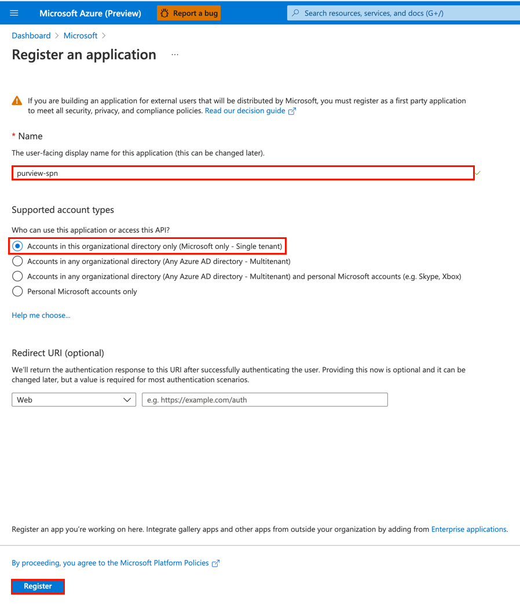
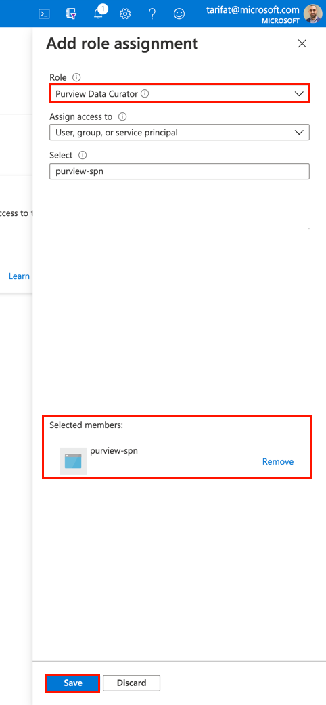

# Module 10 - REST API

[< Previous Module](../modules/module09.md) - **[Home](../README.md)** - [Next Module>](../modules/module11.md)

## :thinking: Prerequisites

* An Azure account with an active subscription.
* An Azure Azure Purview account (see [module 01](../modules/module01.md)).

## :hammer: Tools

* [Postman](https://www.postman.com/product/rest-client/) (API Client)

## Table of Contents

1. [Register an Application](#1-register-an-application)
2. [Generate a Client Secret](#2-generate-a-client-secret)
3. [Provide Service Principal Access to Azure Purview](#3-provide-service-principal-access-to-azure-purview)
4. [Use Postman to Call Azure Purview REST API](#4-use-postman-to-call-azure-purview-rest-api)

<a href="#module-10---rest-api">↥ back to top</a>

## 1. Register an Application

1. Sign in to the [Azure portal](https://portal.azure.com/), navigate to **Azure Active Directory** > **App registrations**, and click **New registration**.

    

2. Provide the application a **name**, select an **account type**, and click **Register**.

    | Property | Example Value |
    | --- | --- |
    | Name | `purview-spn` |
    | Account Type | Accounts in this organizational directory only - Single tenant |
    | Redirect URI (optional) | *Leave blank* |

    

3. **Copy** the following values for later use.

    * Application (client) ID
    * Directory (tenant) ID

    

<a href="#module-10---rest-api">↥ back to top</a>

## 2. Generate a Client Secret

1. Navigate to **Certifications & secrets** and click **New client secret**.

    

2. Provide a **Description** and set the **expiration** to `In 1 year`, click **Add**.

    | Property | Example Value |
    | --- | --- |
    | Description | `purview-api` |
    | Expires | `In 1 year` |

    

3. **Copy** the client secret value for later use.

    

<a href="#module-10---rest-api">↥ back to top</a>

## 3. Provide Service Principal Access to Azure Purview

1. Under the Azure Purview account, navigate to **Access control (IAM)** and click **Add role assignments**.

    

2. Select the **Purview Data Curator** role, select the service principal and click **Save**.

    

<a href="#module-10---rest-api">↥ back to top</a>

## 4. Use Postman to Call Azure Purview REST API

1. Open [Postman](https://www.postman.com/product/rest-client/), create a new **HTTP request** as per the details below.
    
    | Property | Value |
    | --- | --- |
    | HTTP Method | `POST` |
    | URL | `https://login.microsoftonline.com/YOUR_TENANT_ID/oauth2/token` |
    | Body Type | `x-wwww-form-urlencoded` |

    Navigate to **Body**, select `x-wwww-form-urlencoded` and provide the following key value pairs. Once HTTP request is ready, click **Send**. If successful, the response will contain an **access token**, copy this value for later use.

    | Form Key | Form Value |
    | --- | --- |
    | grant_type | `client_credentials` |
    | client_id | `YOUR_CLIENT_ID` |
    | client_secret | `YOUR_CLIENT_SECRET` |
    | resource | `https://purview.azure.net` |

    

2. Using [Postman](https://www.postman.com/product/rest-client/) once more, create a new **HTTP request** as per the details below.

    | Property | Value |
    | --- | --- |
    | HTTP Method | `GET` |
    | URL | `https://YOUR_PURVIEW_ACCOUNT.catalog.purview.azure.com/api/atlas/v2/types/typedefs` |

    Navigate to **Headers**, provide the following key value pair, click **Send**.

    | Header Key | Header Value |
    | --- | --- |
    | Authorization | `Bearer YOUR_ACCESS_TOKEN` |

    

<a href="#module-10---rest-api">↥ back to top</a>

## :tada: Summary

In this module, you learn how to get started with the Azure Purview REST APIs. Anyone who wants to submit data to an Azure Purview Catalog, include the catalog as part of an automated process, or build their own user experience on the catalog can use the REST APIs to do so.
