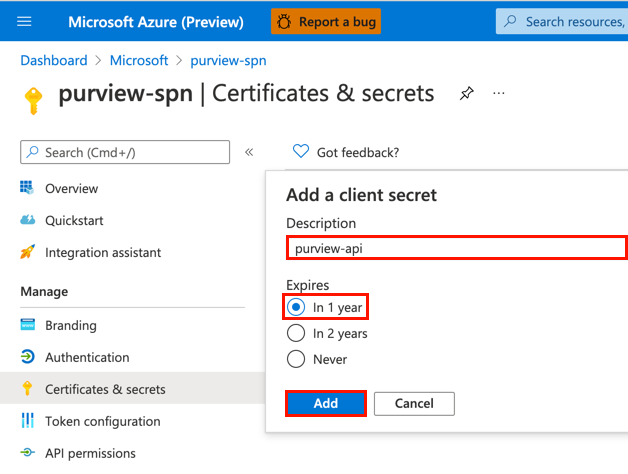
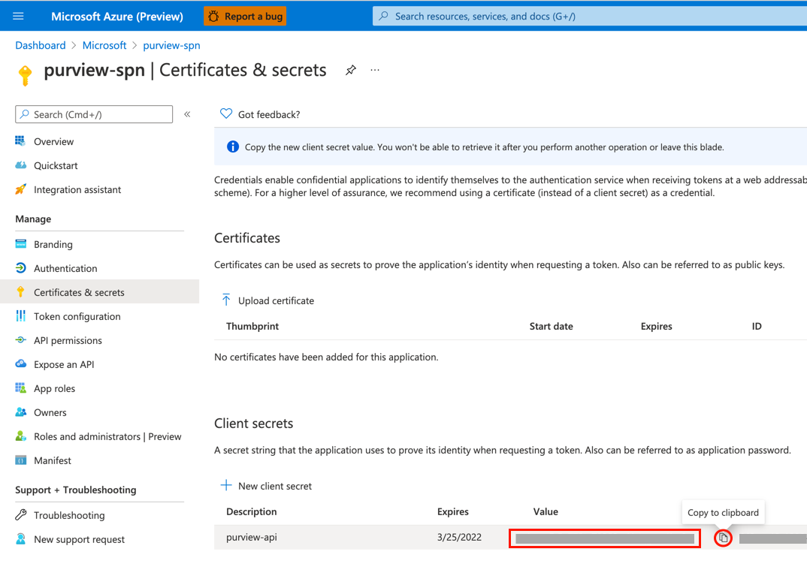
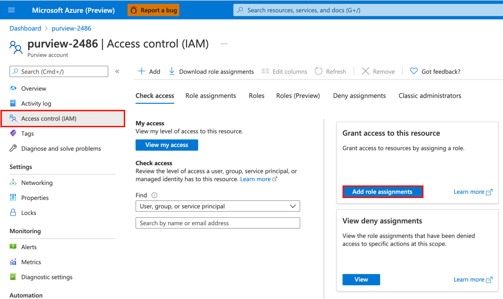

# Module 10 - REST API

[< Previous Module](../modules/module09.md) - **[Home](../README.md)** - [Next Module>](../modules/module11.md)

## Prerequisites

* An Azure account with an active subscription.
* An Azure Azure Purview account (see [module 01](../modules/module01.md)).

## Table of Contents

1. [Register an Application](#1-register-an-application)
2. [Generate a Client Secret](#2-generate-a-client-secret)
3. [Provide Service Principal Access to Azure Purview](#3-provide-service-principal-access-to-azure-purview)
4. [Use Postman to Call Azure Purview REST API](#4-use-postman-to-call-azure-purview-rest-api)

<a href="#module-10---rest-api">↥ back to top</a>

## 1. Register an Application

1. Do A

    

2. Do B

    

3. Do C

    

<a href="#module-10---rest-api">↥ back to top</a>

## 2. Generate a Client Secret

1. Do A

    

2. Do B

    

3. Do C

    

<a href="#module-10---rest-api">↥ back to top</a>

## 3. Provide Service Principal Access to Azure Purview

1. Do A

    

2. Do B

    

<a href="#module-10---rest-api">↥ back to top</a>

## 4. Use Postman to Call Azure Purview REST API

1. Do A

    

2. Do B

    

<a href="#module-10---rest-api">↥ back to top</a>

## Summary

In this module, you learn how to get started with the Azure Purview REST APIs. Anyone who wants to submit data to an Azure Purview Catalog, include the catalog as part of an automated process, or build their own user experience on the catalog can use the REST APIs to do so.
