# Module 12 - Managed private endpoints

## :loudspeaker: Introduction

An integration runtime (IR) is compute infrastructure that Azure Purview uses to power data scan across different network environments. These integration runtimes come in different flavors. One of them is using managed private endpoints, which Microsoft recently added. With this new set of features you can better manage and secure your data scanning within Purview. As a result your metadata traffic is distributed via Azure Private Link, which eliminated any exposure to the internet. This protects you from any data exfiltration risks.

In this lab you'll learn how to make use a managed private endpoints. You'll learn how to configure them.

## :thinking: Prerequisites

- An [Azure account](https://azure.microsoft.com/en-us/free/) with an active subscription.
- A SQL Virtual Machine (see [module 00](../modules/module00.md)).
- An Azure Azure Purview account (see [module 01](../modules/module01.md)).

## :dart: Objectives

- Connect to on premise data source using a self-hosted integration runtime.

## Table of Contents

1. [Resource group creation](#1-resource-group-creation)
2. [Storage account creation](#2-storage-account-creation)
3. [Azure Purview creation](#3-azure-purview-creation)
4. [Authentication for a scan](#4-authenticate-for-a-scan)
5. [Managed Virtual Network Integration Runtime](#5-managed-virtual-network-integration-runtime)
6. [Private endpoint for Azure Blob Storage](#6-private-endpoint-for-azure-blob-storage)
7. [Configure source and scanning](#7-configure-source-and-scanning)

<a href="#module-12---managed-private-endpoints">↥ back to top</a>

## 1. Resource group creation

1. In this lab you will start from scratch by first creating a new resource group. In this tutorial you use Canada Central as the region location because these new features aren’t available on all regions yet. Please consult [this link](https://docs.microsoft.com/en-us/azure/purview/catalog-managed-vnet) for more information.

   

## 2. Storage account creation

1. Next you will setup a storage account for demonstration. This is the resource that will be scanned during our demo. Select create new resource, choose Storage Account, select the resource group you just created, provide a unique name, and hit next.

   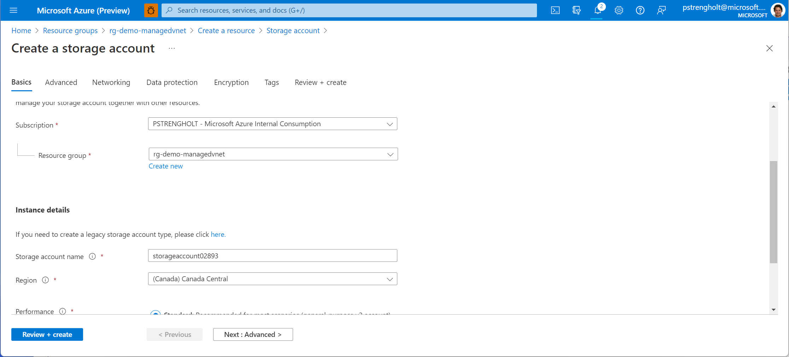

2. For the Storage Account we will ensure that hierarchical namespaces are selected. Click next to jump over to the Networking tab.

   

3. For the networking we select Private endpoint as the connectivity method. Don’t create any private endpoints at this stage. This comes later.

   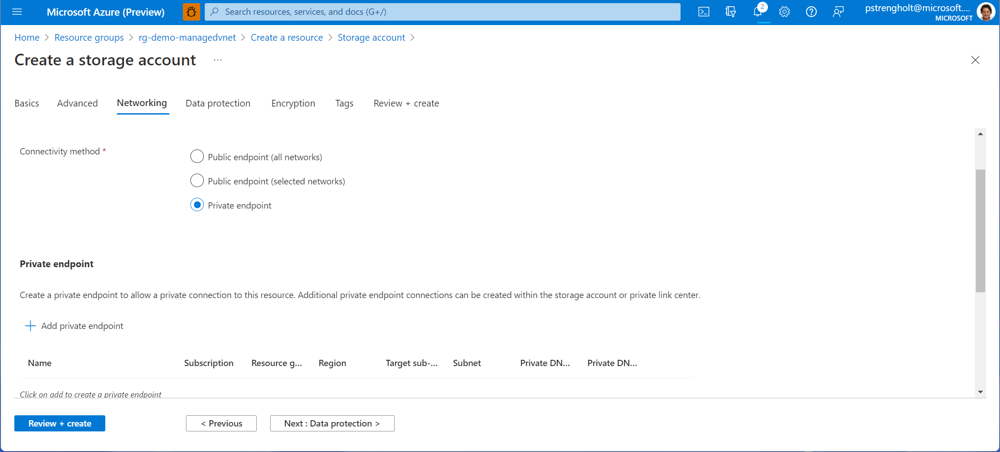

4. After this step you can hit review + create, finalize and wait for the storage account to be created. You can validate the security by creating and opening a container within the storage account. When the account is configured correctly, you should see that access is not permitted in the screen below.

   

## 3. Azure Purview creation

1. After you created your storage account we can move to creating an Azure Purview account. Select create new resource, select Purview, and provide your account details. Remember to use the same region as for the resource group and storage account. You can press review + create.

   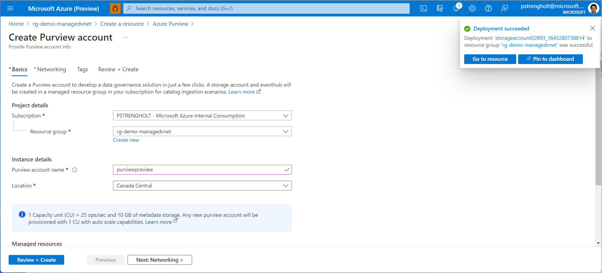

**Note;** we don’t deploy purview here using a private endpoint. You can consider this when you entirely want to lock-down any access to Azure Purview. For example when you allow only client to call to Azure Purview that originate from within the private network. In this demo I don’t want to overcomplicate things.

2. After the resources have been deployed successfully your resource group should look like this:

   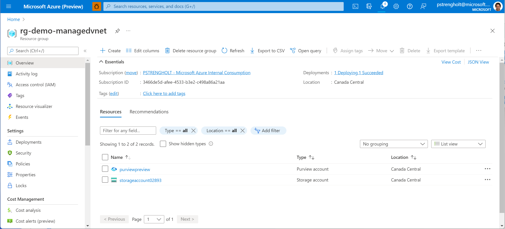

## 4. Authentication for a scan

1. Next we need to give permissions to the storage account so Azure Purview is able to scan. Open the storage account, click on IAM, assign a new role. Set the role to Storage Blob Data Reader and select the managed identity from the newly created Purview account.

   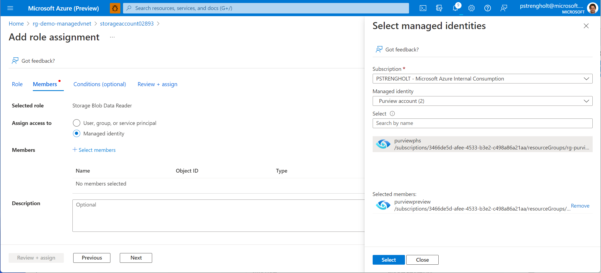

At this stage we’re all set and can continue by opening Azure Purview.

## 5. Managed Virtual Network Integration Runtime

With the newly released features Azure Purview now provides three options for scanning sources:

- **Azure Purview default’s integration runtime**: this option is useful when connecting to data stores and computes services with public accessible endpoints.
- **Self-hosted integration runtimes (SHIR)**: this option particularly useful for VM-based data sources or applications that either sit in a private network (VNET) or other networks, such as on-premises.
- **Managed Virtual Network Integration Runtime**: this new option supports connecting to data stores using private link service in private network environment. This ensures that data scanning process is completely isolated and secure, while also being fully managed.

1. For this demonstration we will use the Managed Virtual Network Integration Runtime. Use your Azure Purview Studio Portal and navigate to your data map on the left. Select integration runtime and choose Azure.

   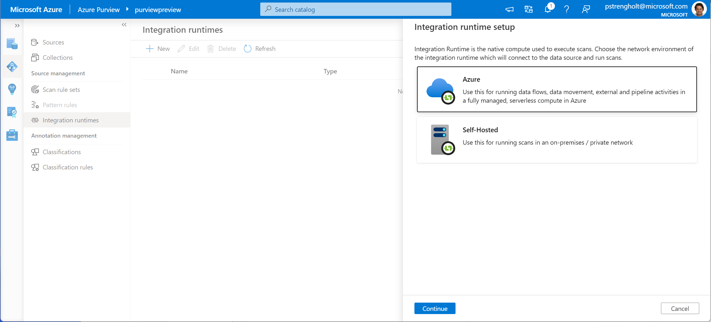

2. Give your new integration runtime a new, description and ensure that interactive authoring is enabled.

   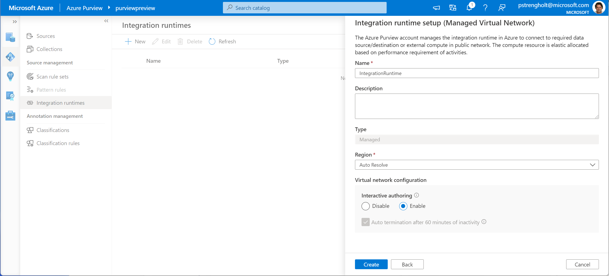

3. After deployment you must wait for the approval notifications. When ready, click on the blue links and navigate to the newly created resources.

   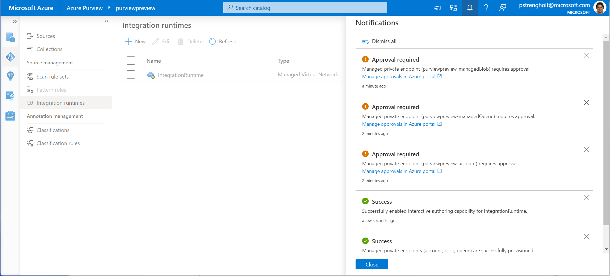

4. For the newly created resources you must approve the Private Endpoint connections. Click on each of them and change the status to Approve.

   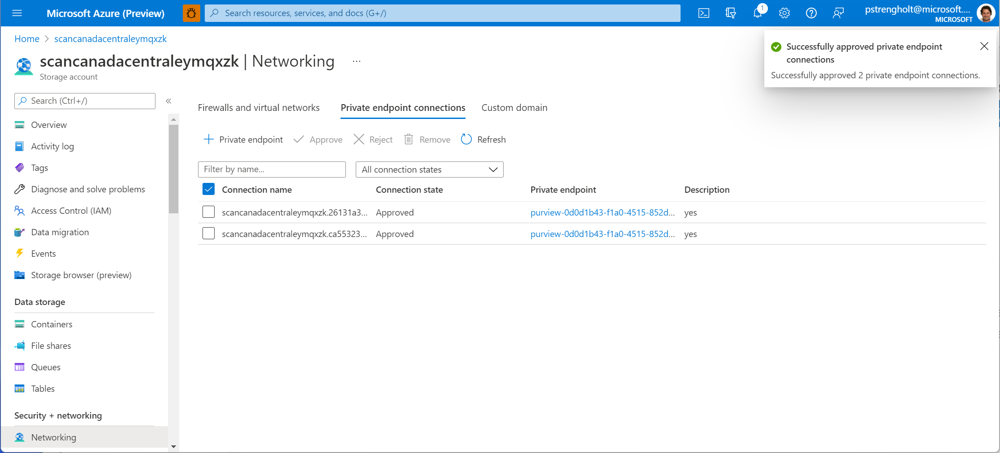

5. Next, hover back to Azure Purview and look up your newly created private endpoints. You can find this option on the left (settings).

   

## 6. Private endpoint for Azure Blob Storage

1. The next step is creating a private endpoint for the newly created storage account. When you are still in the managed private endpoints section, click on new. Select Azure Data Lake Storage Gen2 and continue.

   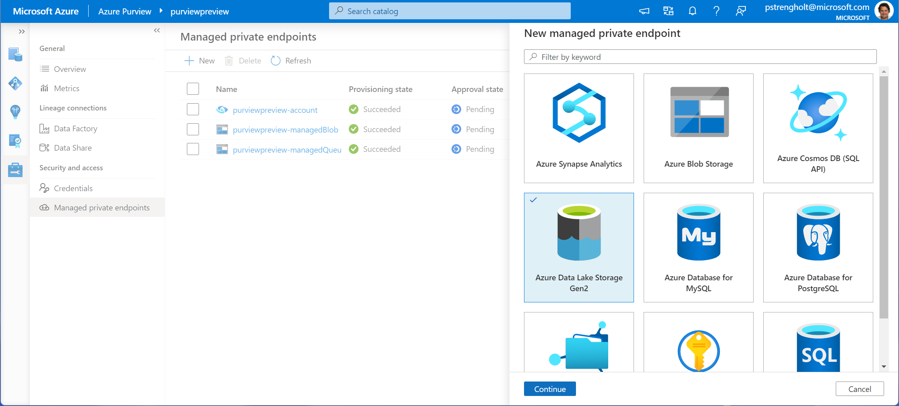

2. Lookup the storage account name under your subscription and click Create.

   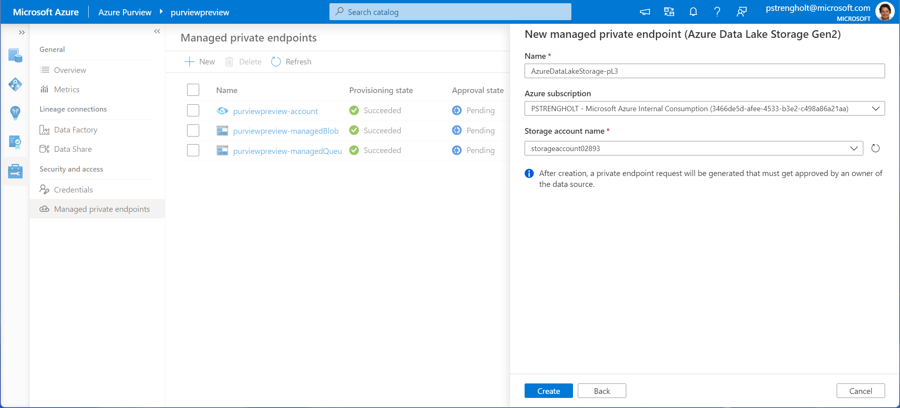

3. The same approval process kicks in. Navigate to your storage account, go to networking, private endpoint connections, and you will see a newly requested item is created. Repeat the same steps by approving the endpoint.

   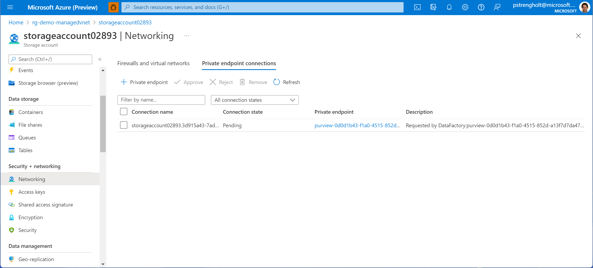

4. Go back to Azure Purview and wait for all managed private endpoints to be approved.

   

## 7. Configure source and scanning

1. Next you need to add your newly created source and setup the scanning. Go to the data map and collection overview. Add a new source and click on Azure Data Lake Storage Gen2.

   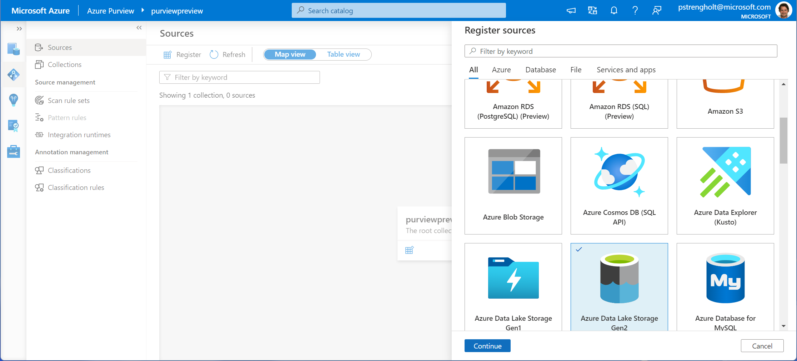

2. Next, register your source. You will see the public endpoint listed here, but this configuration will be overwritten once we start scanning. Hit register and finish.

   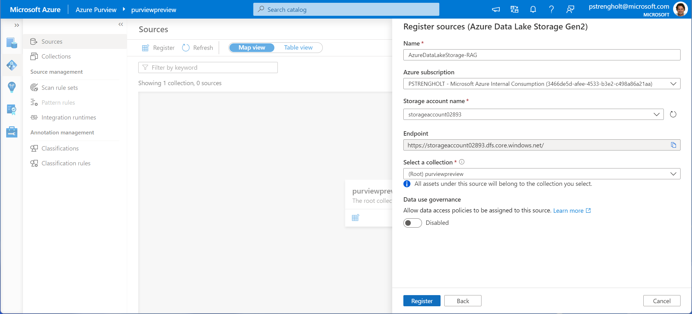

3. Next you configure scanning for your newly created source. It’s important to select the IntegrationRuntime (Managed Virtual Network) from the list. Add your source to a collection, and hit continue.

   

4. Finally, you must test your connection and hit continue. Complete the scanning by selecting a schedule.

   

If everything goes well you’ll notice new metadata will be added to Purview. This all will be very secure, because all metadata is transferred using private endpoints.

> :bulb: **Did you know?**
>
> By using managed private endpoints, you do not have to manage your own VNETs. Microsoft takes care of managing this. [More information](https://docs.microsoft.com/en-us/azure/purview/catalog-managed-vnet).

<a href="#module-12---managed-private-endpoints">↥ back to top</a>

## :mortar_board: Knowledge Check

1. By using managed private endpoints you're protected from any data exfiltration risks.

   A) True  
   B) False

<a href="#module-12---managed-private-endpoints">↥ back to top</a>

## :tada: Summary

In this module, you learned how to install managed private endpoints. If you'd like continue with this module to complete further tasks, please feel free to complete the tutorial links below:

- [Use a Managed VNet with your Azure Purview account](https://docs.microsoft.com/en-us/azure/purview/catalog-managed-vnetn)

[Back to Home >](../README.md)
